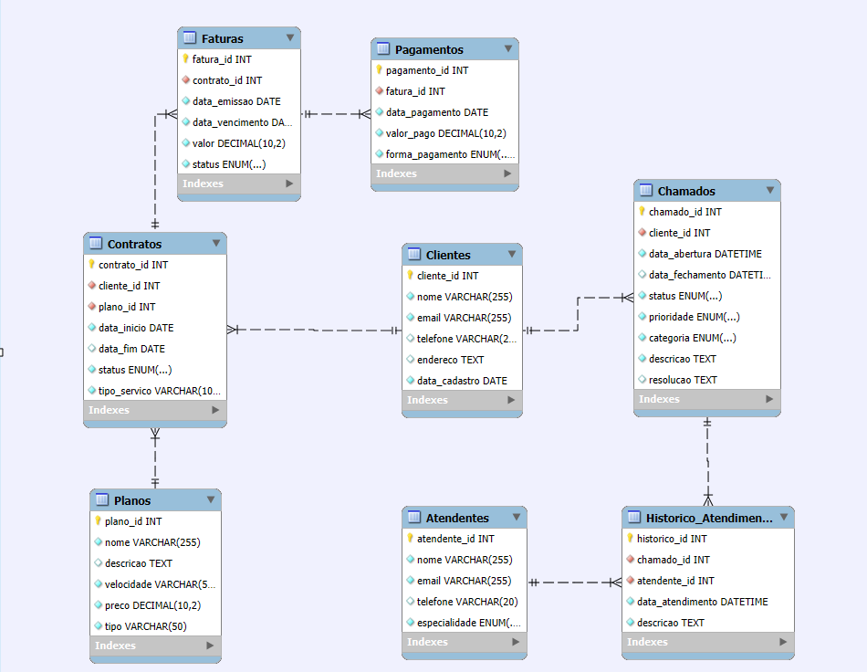
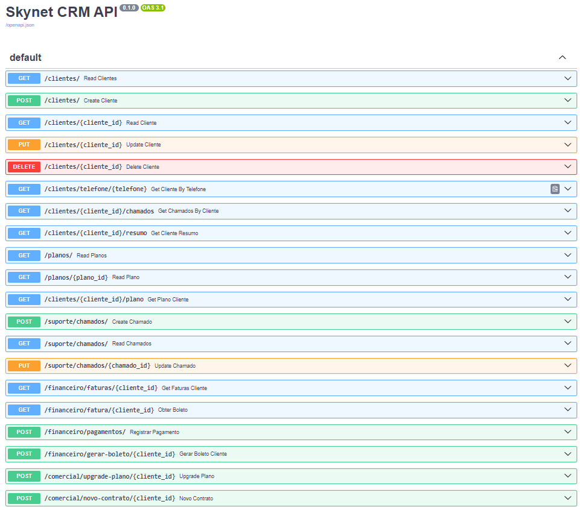

# Projeto Banco de dados SQLite - CRM-Skynet Provider com fastAPI



## Descrição do Projeto

Bem-vindo ao repositório do **Skynet Provider**! Este projeto tem como objetivo simular um ambiente de CRM (Customer Relationship Management) para uma empresa de telecomunicações fictícia, a Skynet Provider, utilizando um banco de dados SQLite e expondo suas funcionalidades através de uma API REST construída com o framework FastAPI.

<a name="indice"></a>
## Índice 

- [Descrição do Projeto](#descrição-do-projeto)
- [Criando o Banco de Dados: skynet](#criando-o-banco-de-dados--skynet)
- [Criando uma View com Informações Gerais do Cliente](#criando-uma-view-com-informações-gerais-do-clieinte)
- [Gerar Dados para o BD](#gerar-dados-para-o-bd)
    - [Criando exemplos de situações para os setores: suporte, financeiro e comercial:](#criando-exemplos-de-situações-para-os-setores-suporte-financeiro-e-comercial)
    - [Script para gerar dados.](#script-para-gerar-dados)
- [Carregar os Dados no BD:](#carregar-os-dados-no-bd)
- [Queries para Teste:](#queries-para-teste)
    - [Setor: Financeiro](#setor-financeiro)
        - [Situação 1: Listar todas as faturas pendentes](#situação-1-listar-todas-as-faturas-pendentes)
        - [Situação 2: Verificar o histórico de pagamentos de um cliente específico](#situação-2-verificar-o-histórico-de-pagamentos-de-um-cliente-específico)
        - [Situação 3: Calcular o total de receitas de um mês específico](#situação-3-calcular-o-total-de-receitas-de-um-mês-específico)
        - [Situação 4: Identificar clientes com pagamentos atrasados](#situação-4-identificar-clientes-com-pagamentos-atrasados)
        - [Situação 5: Relatório de faturas pagas e pendentes por mês](#situação-5-relatório-de-faturas-pagas-e-pendentes-por-mês)
    - [Setor: Suporte](#setor-suporte)
        - [Situação 1: Listar todos os chamados abertos](#situação-1-listar-todos-os-chamados-abertos)
        - [Situação 2: Verificar histórico de atendimento de um cliente específico](#situação-2-verificar-histórico-de-atendimento-de-um-cliente-específico)
        - [Situação 3: Obter o número de chamados por categoria e prioridade](#situação-3-obter-o-número-de-chamados-por-categoria-e-prioridade)
        - [Situação 4: Identificar atendentes mais ativos no mês atual](#situação-4-identificar-atendentes-mais-ativos-no-mês-atual)
        - [Situação 5: Monitorar a taxa de resolução no primeiro contato](#situação-5-monitorar-a-taxa-de-resolução-no-primeiro-contato)
    - [Setor: Comercial](#setor-comercial)
        - [Situação 1: Listar clientes que solicitaram upgrade de plano](#situação-1-listar-clientes-que-solicitaram-upgrade-de-plano)
        - [Situação 2: Obter o número de novos contratos por mês](#situação-2-obter-o-número-de-novos-contratos-por-mês)
        - [Situação 3: Identificar planos mais vendidos](#situação-3-identificar-planos-mais-vendidos)
        - [Situação 4: Analisar taxa de cancelamento de contratos por motivo](#situação-4-analisar-taxa-de-cancelamento-de-contratos-por-motivo)
        - [Situação 5: Identificar clientes em potencial para upsell](#situação-5-identificar-clientes-em-potencial-para-upsell)
- [Construindo uma API-CRUD](#construindo-uma-api-crud)
    - [Documentação da API](#documentação-da-api)
- [Visualizando a Documentação da API](#visualizando-a-documentação-da-api)
- [Conclusão](#conclusão) 

## Criando o Banco de Dados : Skynet


```python
import sqlite3

# Passo 1: Criar conexão com o banco de dados
conn = sqlite3.connect('skynet.db')  # Nome do arquivo do banco de dados SQLite
cursor = conn.cursor()

# Passo 2: Ler o script SQL do arquivo
script_sql = """
-- Tabela `Clientes`
DROP TABLE IF EXISTS Clientes;

CREATE TABLE IF NOT EXISTS Clientes (
  cliente_id INTEGER PRIMARY KEY ,
  cpf TEXT NOT NULL UNIQUE,
  nome TEXT NOT NULL,
  email TEXT NOT NULL,
  telefone TEXT NOT NULL,
  endereco TEXT NOT NULL,
  data_cadastro DATE NOT NULL
);

-- Tabela `Planos`
DROP TABLE IF EXISTS Planos;

CREATE TABLE IF NOT EXISTS Planos (
  plano_id INTEGER PRIMARY KEY ,
  nome TEXT NOT NULL,
  descricao TEXT,
  velocidade TEXT NOT NULL,
  preco DECIMAL(10, 2) NOT NULL,
  tipo TEXT NOT NULL
);

-- Tabela `Contratos`
DROP TABLE IF EXISTS Contratos;

CREATE TABLE IF NOT EXISTS Contratos (
  contrato_id INTEGER PRIMARY KEY ,
  cliente_id INTEGER NOT NULL,
  plano_id INTEGER NOT NULL,
  data_inicio DATE NOT NULL,
  data_fim DATE,
  status TEXT CHECK(status IN ('Ativo', 'Inativo')) NOT NULL,
  tipo_servico TEXT NOT NULL,
  FOREIGN KEY (cliente_id) REFERENCES Clientes (cliente_id),
  FOREIGN KEY (plano_id) REFERENCES Planos (plano_id)
);

-- Tabela `Chamados`
DROP TABLE IF EXISTS Chamados;

CREATE TABLE IF NOT EXISTS Chamados (
  chamado_id INTEGER PRIMARY KEY ,
  cliente_id INTEGER NOT NULL,
  data_abertura DATETIME NOT NULL,
  data_fechamento DATETIME,
  status TEXT CHECK(status IN ('Aberto', 'Em Andamento', 'Fechado')) NOT NULL,
  prioridade TEXT CHECK(prioridade IN ('Baixa', 'Média', 'Alta')) NOT NULL,
  categoria TEXT CHECK(categoria IN ('Suporte', 'Financeiro', 'Comercial')) NOT NULL,
  descricao TEXT NOT NULL,
  resolucao TEXT,
  FOREIGN KEY (cliente_id) REFERENCES Clientes (cliente_id)
);

-- Tabela `Atendentes`
DROP TABLE IF EXISTS Atendentes;

CREATE TABLE IF NOT EXISTS Atendentes (
  atendente_id INTEGER PRIMARY KEY ,
  nome TEXT NOT NULL,
  email TEXT NOT NULL UNIQUE,
  telefone TEXT,
  especialidade TEXT CHECK(especialidade IN ('Suporte', 'Financeiro', 'Comercial')) NOT NULL
);

-- Tabela `Historico_Atendimento`
DROP TABLE IF EXISTS Historico_Atendimento;

CREATE TABLE IF NOT EXISTS Historico_Atendimento (
  historico_id INTEGER PRIMARY KEY ,
  chamado_id INTEGER NOT NULL,
  atendente_id INTEGER NOT NULL,
  data_atendimento DATETIME NOT NULL,
  descricao TEXT NOT NULL,
  historico_texto TEXT,
  FOREIGN KEY (chamado_id) REFERENCES Chamados (chamado_id),
  FOREIGN KEY (atendente_id) REFERENCES Atendentes (atendente_id)
);

-- Tabela `Faturas`
DROP TABLE IF EXISTS Faturas;

CREATE TABLE IF NOT EXISTS Faturas (
  fatura_id INTEGER PRIMARY KEY ,
  contrato_id INTEGER NOT NULL,
  boleto TEXT,
  data_emissao DATE NOT NULL,
  data_vencimento DATE NOT NULL,
  valor DECIMAL(10, 2) NOT NULL,
  status TEXT CHECK(status IN ('Paga', 'Pendente', 'Atrasada')) NOT NULL,  
  FOREIGN KEY (contrato_id) REFERENCES Contratos (contrato_id)
);

-- Tabela `Pagamentos`
DROP TABLE IF EXISTS Pagamentos;

CREATE TABLE IF NOT EXISTS Pagamentos (
  pagamento_id INTEGER PRIMARY KEY ,
  fatura_id INTEGER NOT NULL,
  data_pagamento DATE NOT NULL,
  valor_pago DECIMAL(10, 2) NOT NULL,
  forma_pagamento TEXT CHECK(forma_pagamento IN ('Boleto', 'Crédito', 'PIX', 'Outros')) NOT NULL,
  FOREIGN KEY (fatura_id) REFERENCES Faturas (fatura_id)
);
"""

# Passo 3: Executar o script SQL
cursor.executescript(script_sql)
conn.commit()

# Passo 4: Verificar as tabelas criadas
cursor.execute("SELECT name FROM sqlite_master WHERE type='table';")
tables = cursor.fetchall()

print("Tabelas criadas:")
for table in tables:
    print(table[0])

# Fechar a conexão com o banco de dados
conn.close()

```

    Tabelas criadas:
    Clientes
    Planos
    Contratos
    Chamados
    Atendentes
    Historico_Atendimento
    Faturas
    Pagamentos


[voltar](#índice)

## Criando uma view com informações gerais do clieinte


```python
import sqlite3

# Passo 1: Conectar ao banco de dados
conn = sqlite3.connect('skynet.db')  # Conecta ao banco de dados SQLite existente ou cria um novo
cursor = conn.cursor()

# Passo 2: Criar a view 'ClienteInfo'
create_view_sql = """
CREATE VIEW IF NOT EXISTS ClienteInfo AS
SELECT 
    c.cpf,
    c.nome AS Cliente,
    ctr.tipo_servico AS Serviço,
    ch.status AS Chamados,
    ch.categoria AS Setor,
    ch.descricao AS Problema
FROM 
    Clientes c
LEFT JOIN contratos ctr ON c.cliente_id = ctr.cliente_id
LEFT JOIN Chamados ch ON c.cliente_id = ch.cliente_id;
"""

cursor.executescript(create_view_sql)
conn.commit()

# Passo 3: Verificar se a view foi criada corretamente
cursor.execute("SELECT name FROM sqlite_master WHERE type='view';")
views = cursor.fetchall()

print("Views criadas:")
for view in views:
    print(view[0])

# Fechar a conexão
conn.close()
```

    Views criadas:
    ClienteInfo


[voltar](#índice)

## Gerar dados para o BD

### Criando exemplos de situações para os setores: suporte, financeiro e comercial:


```python
atendimento_situacoes = {
    'Suporte': [
        {
            'descricao': 'Cliente relata lentidão na conexão',
            'historico_texto': 'Realizado teste de velocidade e orientado a reiniciar o roteador',
            'resolucao': 'Problema resolvido após reinicialização do equipamento'
        },
        {
            'descricao': 'Sem conexão à internet',
            'historico_texto': 'Verificado status do sinal e realizado diagnóstico remoto',
            'resolucao': 'Identificado problema na fibra, agendada visita técnica'
        },
        {
            'descricao': 'Dificuldade em configurar roteador Wi-Fi',
            'historico_texto': 'Fornecidas instruções passo a passo para configuração',
            'resolucao': 'Cliente conseguiu configurar o roteador com sucesso'
        },
        {
            'descricao': 'Reclamação de instabilidade na conexão',
            'historico_texto': 'Analisado histórico de conexão e identificados picos de uso',
            'resolucao': 'Recomendada atualização do plano para melhor estabilidade'
        },
        {
            'descricao': 'Solicitação de suporte para instalação de câmeras IP',
            'historico_texto': 'Explicado processo de configuração e redirecionamento de portas',
            'resolucao': 'Cliente conseguiu configurar as câmeras com o suporte fornecido'
        },
        {
            'descricao': 'Problemas com e-mail corporativo',
            'historico_texto': 'Verificadas configurações de SMTP e IMAP no cliente de e-mail',
            'resolucao': 'Corrigidas configurações e e-mail funcionando normalmente'
        },
        {
            'descricao': 'Lentidão em serviços de streaming',
            'historico_texto': 'Realizado teste de velocidade e verificada qualidade do sinal',
            'resolucao': 'Identificada interferência Wi-Fi, recomendada mudança de canal'
        },
        {
            'descricao': 'Dúvidas sobre segurança da rede',
            'historico_texto': 'Explicadas medidas de segurança e recomendado uso de VPN',
            'resolucao': 'Cliente orientado sobre melhores práticas de segurança'
        },
        {
            'descricao': 'Solicitação de aumento temporário de velocidade',
            'historico_texto': 'Verificada disponibilidade técnica para upgrade',
            'resolucao': 'Realizado upgrade temporário conforme solicitação do cliente'
        },
        {
            'descricao': 'Problemas de conexão em jogos online',
            'historico_texto': 'Analisada latência e perda de pacotes',
            'resolucao': 'Ajustadas configurações de QoS no roteador do cliente'
        }
    ],
    'Financeiro': [
        {
            'descricao': 'Dúvidas sobre fatura mensal',
            'historico_texto': 'Explicado detalhamento dos serviços cobrados',
            'resolucao': 'Cliente compreendeu a fatura e confirmou o pagamento'
        },
        {
            'descricao': 'Solicitação de alteração de data de vencimento',
            'historico_texto': 'Verificadas opções de datas disponíveis',
            'resolucao': 'Alterada data de vencimento conforme solicitação do cliente'
        },
        {
            'descricao': 'Contestação de valor na fatura',
            'historico_texto': 'Analisado histórico de consumo e serviços contratados',
            'resolucao': 'Identificado erro de cobrança, emitida nova fatura corrigida'
        },
        {
            'descricao': 'Solicitação de parcelamento de débitos',
            'historico_texto': 'Apresentadas opções de parcelamento disponíveis',
            'resolucao': 'Realizado parcelamento em 3x sem juros conforme acordo'
        },
        {
            'descricao': 'Informações sobre métodos de pagamento',
            'historico_texto': 'Explicadas opções de pagamento: boleto, cartão e débito automático',
            'resolucao': 'Cliente optou por aderir ao débito automático'
        },
        {
            'descricao': 'Dúvidas sobre desconto de pontualidade',
            'historico_texto': 'Esclarecidas regras do programa de desconto por pagamento em dia',
            'resolucao': 'Cliente entendeu o funcionamento e decidiu manter pagamentos em dia'
        },
        {
            'descricao': 'Solicitação de segunda via de fatura',
            'historico_texto': 'Verificado sistema de faturamento e gerada segunda via',
            'resolucao': 'Enviada segunda via por e-mail conforme solicitação'
        },
        {
            'descricao': 'Informações sobre multa e juros por atraso',
            'historico_texto': 'Explicada política de cobrança de multas e juros',
            'resolucao': 'Cliente informado e orientado sobre prazos de pagamento'
        },
        {
            'descricao': 'Dúvidas sobre cobrança pro-rata na instalação',
            'historico_texto': 'Detalhado cálculo pro-rata para o primeiro mês de serviço',
            'resolucao': 'Cliente compreendeu o cálculo e aceitou os valores'
        },
        {
            'descricao': 'Solicitação de nota fiscal',
            'historico_texto': 'Verificado status de emissão da nota fiscal',
            'resolucao': 'Nota fiscal emitida e enviada por e-mail ao cliente'
        }
    ],
    'Comercial': [
        {
            'descricao': 'Interesse em upgrade de plano',
            'historico_texto': 'Apresentadas opções de planos superiores e seus benefícios',
            'resolucao': 'Cliente decidiu fazer upgrade para o plano 100Mbps'
        },
        {
            'descricao': 'Solicitação de informações sobre planos empresariais',
            'historico_texto': 'Explicadas opções de planos dedicados e suas vantagens',
            'resolucao': 'Agendada visita técnica para avaliação das necessidades da empresa'
        },
        {
            'descricao': 'Dúvidas sobre pacote combo (internet + TV)',
            'historico_texto': 'Detalhados canais inclusos e vantagens do combo',
            'resolucao': 'Cliente aderiu ao pacote combo com desconto promocional'
        },
        {
            'descricao': 'Interesse em serviços de cloud para empresa',
            'historico_texto': 'Apresentadas soluções de cloud computing e backup',
            'resolucao': 'Cliente solicitou proposta detalhada para avaliação interna'
        },
        {
            'descricao': 'Informações sobre cobertura em nova localidade',
            'historico_texto': 'Verificada disponibilidade de serviço no endereço informado',
            'resolucao': 'Confirmada cobertura e agendada instalação para nova localidade'
        },
        {
            'descricao': 'Solicitação de cancelamento de serviço',
            'historico_texto': 'Investigados motivos e oferecidas alternativas para retenção',
            'resolucao': 'Cliente decidiu permanecer após oferta de upgrade sem custo adicional'
        },
        {
            'descricao': 'Dúvidas sobre fidelidade contratual',
            'historico_texto': 'Explicadas condições de fidelidade e multa por quebra de contrato',
            'resolucao': 'Cliente compreendeu os termos e decidiu manter o contrato'
        },
        {
            'descricao': 'Interesse em serviço de IP fixo',
            'historico_texto': 'Apresentados benefícios e custos adicionais do IP fixo',
            'resolucao': 'Cliente contratou serviço de IP fixo para sua empresa'
        },
        {
            'descricao': 'Solicitação de proposta para condomínio',
            'historico_texto': 'Coletadas informações sobre o condomínio e suas necessidades',
            'resolucao': 'Elaborada proposta personalizada e agendada apresentação'
        },
        {
            'descricao': 'Dúvidas sobre prazo de instalação',
            'historico_texto': 'Verificado cronograma de instalações e disponibilidade de equipe',
            'resolucao': 'Informado prazo de 5 dias úteis e agendada data com o cliente'
        }
    ]
}
```

[voltar](#índice)

### Script para gerar dados.


```python
import csv
from faker import Faker
from datetime import datetime, timedelta
import random

# Configuração do Faker
fake = Faker('pt_BR')

# Definir a data atual como 2024-09-03
current_date = datetime(2024, 9, 3)

# Mapeamento de DDD para Estado e Cidade
ddd_mapping = {
    '11': ('SP', 'São Paulo'),
    '21': ('RJ', 'Rio de Janeiro'),
    '31': ('MG', 'Belo Horizonte'),
    '41': ('PR', 'Curitiba'),
    '51': ('RS', 'Porto Alegre'),
    '61': ('DF', 'Brasília'),
    '71': ('BA', 'Salvador'),
    '81': ('PE', 'Recife'),
    '91': ('PA', 'Belém'),
}

# Função para gerar um número de telefone com DDD válido
def generate_phone(ddd):
    return f'{ddd}9{fake.msisdn()[5:]}'

# Função para gerar um endereço baseado no DDD
def generate_address(ddd):
    state, city = ddd_mapping[ddd]
    return f'{fake.street_address()}, {city}, {state}, {fake.postcode()}'

# Função para gerar um email com base no nome e sobrenome
def generate_email(name):
    first_name, last_name = name.split(' ', 1)
    username = f"{first_name.lower()}.{last_name.lower().replace(' ', '')}"
    return f"{username}@Skynet.com"

# Gerar dados para a tabela Clientes
def generate_clients(num_clients):
    clients = []
    for _ in range(num_clients):
        name = fake.name()
        ddd = random.choice(list(ddd_mapping.keys()))
        client = {
            'cliente_id': _ + 1,
            'cpf': fake.cpf(),
            'nome': name,
            'email': generate_email(name),
            'telefone': generate_phone(ddd),
            'endereco': generate_address(ddd),
            'data_cadastro': fake.date_between(start_date=current_date - timedelta(days=2*365), end_date=current_date).strftime('%Y-%m-%d')
        }
        clients.append(client)
    return clients

# Gerar dados para a tabela Planos
def generate_plans():
    plans = [
        {'plano_id': 1, 'nome': 'Básico', 'descricao': 'Plano de internet', 'velocidade': '100 Mbps', 'preco': 49.99, 'tipo': 'Residencial'},
        {'plano_id': 2, 'nome': 'Padrão', 'descricao': 'Combo(internet + tv)', 'velocidade': '200 Mbps', 'preco': 79.99, 'tipo': 'Residencial'},
        {'plano_id': 3, 'nome': 'Premium', 'descricao': 'Combo(internet + tv + mobile)', 'velocidade': '300 Mbps', 'preco': 119.99, 'tipo': 'Residencial'},
        {'plano_id': 4, 'nome': 'Gold', 'descricao': 'Combo(internet + tv + mobile)', 'velocidade': '500 Mbps', 'preco': 199.99, 'tipo': 'Residencial'},
        {'plano_id': 5, 'nome': 'Empresarial', 'descricao': 'Plano para empresas', 'velocidade': '1 Gbps', 'preco': 499.99, 'tipo': 'Empresarial'},
    ]
    return plans

# Gerar dados para a tabela Chamados
def generate_tickets(num_tickets, clients):
    tickets = []
    for i in range(num_tickets):
        client = random.choice(clients)
        open_date = datetime.strptime(client['data_cadastro'], '%Y-%m-%d') + timedelta(days=random.randint(1, 365))
        if open_date > current_date:
            open_date = current_date
        categoria = random.choice(['Suporte', 'Financeiro', 'Comercial'])
        situacao = random.choice(atendimento_situacoes[categoria])
        ticket = {
            'chamado_id': i + 1,
            'cliente_id': client['cliente_id'],
            'data_abertura': open_date.strftime('%Y-%m-%d'),
            'data_fechamento': (open_date + timedelta(days=random.randint(1, 7))).strftime('%Y-%m-%d') if random.random() < 0.8 else None,
            'status': random.choice(['Aberto', 'Em Andamento', 'Fechado']),
            'prioridade': random.choice(['Baixa', 'Média', 'Alta']),
            'categoria': categoria,
            'descricao': situacao['descricao'],
            'resolucao': situacao['resolucao'] if random.random() < 0.8 else None
        }
        tickets.append(ticket)
    return tickets

# Gerar históricos
def generate_service_history(tickets, attendants):
    history = []
    for ticket in tickets:
        service_date = ticket['data_abertura']
        categoria = ticket['categoria']
        situacao = next(s for s in atendimento_situacoes[categoria] if s['descricao'] == ticket['descricao'])
        
        record = {
            'historico_id': len(history) + 1,
            'chamado_id': ticket['chamado_id'],
            'atendente_id': random.choice(attendants)['atendente_id'],
            'data_atendimento': service_date,
            'descricao': ticket['descricao'],
            'historico_texto': situacao['historico_texto']
        }
        history.append(record)
    return history


# Gerar dados para a tabela Atendentes
def generate_attendants(num_attendants):
    attendants = []
    for i in range(num_attendants):
        name = fake.name()
        ddd = random.choice(list(ddd_mapping.keys()))
        attendant = {
            'atendente_id': i + 1,
            'nome': name,
            'email': generate_email(name),
            'telefone': generate_phone(ddd),
            'especialidade': random.choice(['Suporte', 'Financeiro', 'Comercial'])
        }
        attendants.append(attendant)
    return attendants


# Função para gerar código dos boletos 
def gerar_codigo_boleto():
    campo1 = f"{random.randint(10000, 99999):05d}"
    campo2 = f"{random.randint(10000, 99999):05d}"
    campo3 = f"{random.randint(10000, 99999):05d}"
    campo4 = f"{random.randint(10000, 99999):05d}"
    campo5 = f"{random.randint(10000, 99999):05d}"
    dv = random.randint(0, 9)
    linha_digitavel = f"23790.{campo1} {campo2}.{campo3} {campo4}.{campo5} {dv} {campo1}{campo2}{campo3}{campo4}{campo5}"
    return linha_digitavel

# Gerar dados para a tabela Contratos
def generate_contracts(clients, plans):
    contracts = []
    for client in clients:
        plan = random.choice(plans)
        start_date = datetime.strptime(client['data_cadastro'], '%Y-%m-%d') + timedelta(days=random.randint(1, 30))
        contract = {
            'contrato_id': len(contracts) + 1,
            'cliente_id': client['cliente_id'],
            'plano_id': plan['plano_id'],
            'data_inicio': start_date.strftime('%Y-%m-%d'),
            'data_fim': None,
            'status': 'Ativo',
            'tipo_servico': 'Internet' if plan['nome'] == 'Básico' else 'Combo'
        }
        contracts.append(contract)
    return contracts

# Gerar dados para a tabela Faturas
def generate_invoices(contracts, plans):
    invoices = []
    for contract in contracts:
        plan = next(p for p in plans if p['plano_id'] == contract['plano_id'])
        start_date = datetime.strptime(contract['data_inicio'], '%Y-%m-%d')
        months = (current_date.year - start_date.year) * 12 + current_date.month - start_date.month
        for i in range(months + 1):
            issue_date = start_date + timedelta(days=30*i)
            if issue_date > current_date:
                break
            is_overdue = False
            current_year = current_date.year
            current_month = current_date.month 
            if issue_date.year == current_year and issue_date.month >= current_month -2: 
                is_overdue = True
                   
            invoice = {
                'fatura_id': len(invoices) + 1,
                'contrato_id': contract['contrato_id'],
                'boleto': gerar_codigo_boleto(),
                'data_emissao': issue_date.strftime('%Y-%m-%d'),
                'data_vencimento': (issue_date + timedelta(days=10)).strftime('%Y-%m-%d'),
                'valor': plan['preco'],
                'status': random.choices(['Paga', 'Atrasada'], weights=[0.5, 0.5])[0] if is_overdue else 'Paga'
            }
            invoices.append(invoice)
    return invoices

# Gerar dados para a tabela Pagamentos
def generate_payments(invoices):
    payments = []
    for invoice in invoices:
        if invoice['status'] == 'Paga':
            payment_date = datetime.strptime(invoice['data_vencimento'], '%Y-%m-%d') + timedelta(days=random.randint(-5, 2))
            if payment_date > current_date:
                payment_date = current_date
            payment = {
                'pagamento_id': len(payments) + 1,
                'fatura_id': invoice['fatura_id'],
                'data_pagamento': payment_date.strftime('%Y-%m-%d'),
                'valor_pago': invoice['valor'],
                'forma_pagamento': random.choice(['Boleto', 'Crédito', 'PIX', 'Outros'])
            }
            payments.append(payment)
    return payments

# Definir quantidades
num_clients = 50
num_tickets = 100
num_attendants = 10

# Gerar dados
clients = generate_clients(num_clients)
plans = generate_plans()
contracts = generate_contracts(clients, plans)
tickets = generate_tickets(num_tickets, clients)
attendants = generate_attendants(num_attendants)
service_history = generate_service_history(tickets, attendants)
invoices = generate_invoices(contracts, plans)
payments = generate_payments(invoices)

# Salvar dados em arquivos CSV
def save_to_csv(data, filename):
    with open(filename, 'w', newline='', encoding='utf-8') as file:
        writer = csv.DictWriter(file, fieldnames=data[0].keys())
        writer.writeheader()
        writer.writerows(data)

save_to_csv(clients, 'clientes.csv')
save_to_csv(plans, 'planos.csv')
save_to_csv(contracts, 'contratos.csv')
save_to_csv(tickets, 'chamados.csv')
save_to_csv(attendants, 'atendentes.csv')
save_to_csv(service_history, 'historico_atendimento.csv')
save_to_csv(invoices, 'faturas.csv')
save_to_csv(payments, 'pagamentos.csv')

print("Dados gerados e salvos em arquivos CSV.")
```

    Dados gerados e salvos em arquivos CSV.


[voltar](#índice)

## Carregar os Dados no BD:


```python
import sqlite3
import csv

def load_data_from_csv(conn, table_name, csv_file):
    cursor = conn.cursor()
    with open(csv_file, 'r', encoding='utf-8') as file:
        reader = csv.DictReader(file)
        columns = ', '.join(reader.fieldnames)
        placeholders = ':' + ', :'.join(reader.fieldnames)
        sql = f'INSERT INTO {table_name} ({columns}) VALUES ({placeholders})'
        for row in reader:
            cursor.execute(sql, row)
    conn.commit()

# Conectar ao banco de dados
conn = sqlite3.connect('skynet.db')

# Carregar dados de cada arquivo CSV para as respectivas tabelas
load_data_from_csv(conn, 'Clientes', 'clientes.csv')
load_data_from_csv(conn, 'Planos', 'planos.csv')
load_data_from_csv(conn, 'Contratos', 'contratos.csv')
load_data_from_csv(conn, 'Chamados', 'chamados.csv')
load_data_from_csv(conn, 'Atendentes', 'atendentes.csv')
load_data_from_csv(conn, 'Historico_Atendimento', 'historico_atendimento.csv')
load_data_from_csv(conn, 'Faturas', 'faturas.csv')
load_data_from_csv(conn, 'Pagamentos', 'pagamentos.csv')

# Fechar a conexão
conn.close()

print("Dados carregados com sucesso para o banco de dados SQLite.")
```

    Dados carregados com sucesso para o banco de dados SQLite.


[voltar](#índice)

## Queries para teste:

Vamos criar exemplos de situações prováveis para cada setor (Financeiro, Suporte e Comercial) usando consultas SQL (queries) ao banco de dados `skynet.db`. Em cada caso, vou fornecer uma explicação clara da situação e da solução encontrada.

### Setor: Financeiro

#### Situação 1: **Listar todas as faturas pendentes**
**Situação:** Você deseja ver todas as faturas que ainda não foram pagas para enviar lembretes aos clientes.

**Query SQL:**
```sql
SELECT f.fatura_id, c.nome, f.data_emissao, f.data_vencimento, f.valor, f.status
FROM Faturas f
JOIN Contratos ct ON f.contrato_id = ct.contrato_id
JOIN Clientes c ON ct.cliente_id = c.cliente_id
WHERE f.status = 'Atrasada';
```

**Explicação:** Esta consulta seleciona o cliente_id da fatura, o nome do cliente, a data de emissão, a data de vencimento, o valor da fatura e o status para todas as faturas cujo status é "Pendente". Isso permite que a equipe financeira identifique rapidamente quais clientes precisam ser lembrados do pagamento.


```python
# Passo 1: Conectar ao banco de dados
import pandas as pd
conn = sqlite3.connect('skynet.db')
```


```python
query = ''' 
SELECT f.fatura_id, c.nome, f.data_emissao, f.data_vencimento, f.valor, f.status
FROM Faturas f
JOIN Contratos ct ON f.contrato_id = ct.contrato_id
JOIN Clientes c ON ct.cliente_id = c.cliente_id
WHERE f.status = 'Atrasada'
'''
```


```python
pd.read_sql(query,conn)
```


<div>
 

     

     
 
<table border="1" class="dataframe">
  <thead>
    <tr style="text-align: right;">
      <th></th>
      <th>fatura_id</th>
      <th>nome</th>
      <th>data_emissao</th>
      <th>data_vencimento</th>
      <th>valor</th>
      <th>status</th>
    </tr>
  </thead>
  <tbody>
    <tr>
      <th>0</th>
      <td>9</td>
      <td>Ayla Viana</td>
      <td>2024-07-01</td>
      <td>2024-07-11</td>
      <td>499.99</td>
      <td>Atrasada</td>
    </tr>
    <tr>
      <th>1</th>
      <td>10</td>
      <td>Ayla Viana</td>
      <td>2024-07-31</td>
      <td>2024-08-10</td>
      <td>499.99</td>
      <td>Atrasada</td>
    </tr>
    <tr>
      <th>2</th>
      <td>11</td>
      <td>Ayla Viana</td>
      <td>2024-08-30</td>
      <td>2024-09-09</td>
      <td>499.99</td>
      <td>Atrasada</td>
    </tr>
    <tr>
      <th>3</th>
      <td>29</td>
      <td>Maria Julia Gomes</td>
      <td>2024-07-18</td>
      <td>2024-07-28</td>
      <td>79.99</td>
      <td>Atrasada</td>
    </tr>
    <tr>
      <th>4</th>
      <td>37</td>
      <td>Ana Beatriz Fonseca</td>
      <td>2024-07-23</td>
      <td>2024-08-02</td>
      <td>119.99</td>
      <td>Atrasada</td>
    </tr>
    <tr>
      <th>5</th>
      <td>38</td>
      <td>Ana Beatriz Fonseca</td>
      <td>2024-08-22</td>
      <td>2024-09-01</td>
      <td>119.99</td>
      <td>Atrasada</td>
    </tr>
    <tr>
      <th>6</th>
      <td>41</td>
      <td>Rebeca da Cruz</td>
      <td>2024-08-06</td>
      <td>2024-08-16</td>
      <td>119.99</td>
      <td>Atrasada</td>
    </tr>
    <tr>
      <th>7</th>
      <td>47</td>
      <td>Sr. Vitor Hugo Sampaio</td>
      <td>2024-08-02</td>
      <td>2024-08-12</td>
      <td>499.99</td>
      <td>Atrasada</td>
    </tr>
    <tr>
      <th>8</th>
      <td>48</td>
      <td>Sr. Vitor Hugo Sampaio</td>
      <td>2024-09-01</td>
      <td>2024-09-11</td>
      <td>499.99</td>
      <td>Atrasada</td>
    </tr>
    <tr>
      <th>9</th>
      <td>61</td>
      <td>Heloísa da Conceição</td>
      <td>2024-07-26</td>
      <td>2024-08-05</td>
      <td>79.99</td>
      <td>Atrasada</td>
    </tr>
    <tr>
      <th>10</th>
      <td>62</td>
      <td>Heloísa da Conceição</td>
      <td>2024-08-25</td>
      <td>2024-09-04</td>
      <td>79.99</td>
      <td>Atrasada</td>
    </tr>
    <tr>
      <th>11</th>
      <td>81</td>
      <td>Isaac Ramos</td>
      <td>2024-07-20</td>
      <td>2024-07-30</td>
      <td>79.99</td>
      <td>Atrasada</td>
    </tr>
    <tr>
      <th>12</th>
      <td>92</td>
      <td>Fernanda Pastor</td>
      <td>2024-07-02</td>
      <td>2024-07-12</td>
      <td>49.99</td>
      <td>Atrasada</td>
    </tr>
    <tr>
      <th>13</th>
      <td>93</td>
      <td>Fernanda Pastor</td>
      <td>2024-08-01</td>
      <td>2024-08-11</td>
      <td>49.99</td>
      <td>Atrasada</td>
    </tr>
    <tr>
      <th>14</th>
      <td>94</td>
      <td>Fernanda Pastor</td>
      <td>2024-08-31</td>
      <td>2024-09-10</td>
      <td>49.99</td>
      <td>Atrasada</td>
    </tr>
    <tr>
      <th>15</th>
      <td>106</td>
      <td>Sr. José Pedro Casa Grande</td>
      <td>2024-08-19</td>
      <td>2024-08-29</td>
      <td>499.99</td>
      <td>Atrasada</td>
    </tr>
    <tr>
      <th>16</th>
      <td>116</td>
      <td>Raul Costela</td>
      <td>2024-07-06</td>
      <td>2024-07-16</td>
      <td>499.99</td>
      <td>Atrasada</td>
    </tr>
    <tr>
      <th>17</th>
      <td>117</td>
      <td>Raul Costela</td>
      <td>2024-08-05</td>
      <td>2024-08-15</td>
      <td>499.99</td>
      <td>Atrasada</td>
    </tr>
    <tr>
      <th>18</th>
      <td>121</td>
      <td>Dra. Nicole Cavalcante</td>
      <td>2024-07-20</td>
      <td>2024-07-30</td>
      <td>119.99</td>
      <td>Atrasada</td>
    </tr>
    <tr>
      <th>19</th>
      <td>126</td>
      <td>Maria Luiza Pereira</td>
      <td>2024-07-13</td>
      <td>2024-07-23</td>
      <td>79.99</td>
      <td>Atrasada</td>
    </tr>
    <tr>
      <th>20</th>
      <td>148</td>
      <td>Ravi Lopes</td>
      <td>2024-07-27</td>
      <td>2024-08-06</td>
      <td>79.99</td>
      <td>Atrasada</td>
    </tr>
    <tr>
      <th>21</th>
      <td>172</td>
      <td>Ana Clara Porto</td>
      <td>2024-08-17</td>
      <td>2024-08-27</td>
      <td>499.99</td>
      <td>Atrasada</td>
    </tr>
    <tr>
      <th>22</th>
      <td>191</td>
      <td>João Gabriel Andrade</td>
      <td>2024-08-24</td>
      <td>2024-09-03</td>
      <td>49.99</td>
      <td>Atrasada</td>
    </tr>
    <tr>
      <th>23</th>
      <td>199</td>
      <td>Maria Eduarda da Cruz</td>
      <td>2024-07-01</td>
      <td>2024-07-11</td>
      <td>49.99</td>
      <td>Atrasada</td>
    </tr>
    <tr>
      <th>24</th>
      <td>218</td>
      <td>Ana Clara Ribeiro</td>
      <td>2024-07-27</td>
      <td>2024-08-06</td>
      <td>199.99</td>
      <td>Atrasada</td>
    </tr>
    <tr>
      <th>25</th>
      <td>228</td>
      <td>Olivia Peixoto</td>
      <td>2024-07-20</td>
      <td>2024-07-30</td>
      <td>79.99</td>
      <td>Atrasada</td>
    </tr>
    <tr>
      <th>26</th>
      <td>229</td>
      <td>Olivia Peixoto</td>
      <td>2024-08-19</td>
      <td>2024-08-29</td>
      <td>79.99</td>
      <td>Atrasada</td>
    </tr>
    <tr>
      <th>27</th>
      <td>254</td>
      <td>Sra. Ana Júlia Lopes</td>
      <td>2024-08-06</td>
      <td>2024-08-16</td>
      <td>79.99</td>
      <td>Atrasada</td>
    </tr>
    <tr>
      <th>28</th>
      <td>273</td>
      <td>Luana Monteiro</td>
      <td>2024-08-11</td>
      <td>2024-08-21</td>
      <td>499.99</td>
      <td>Atrasada</td>
    </tr>
    <tr>
      <th>29</th>
      <td>288</td>
      <td>Gustavo Pastor</td>
      <td>2024-08-22</td>
      <td>2024-09-01</td>
      <td>119.99</td>
      <td>Atrasada</td>
    </tr>
    <tr>
      <th>30</th>
      <td>306</td>
      <td>Henrique Andrade</td>
      <td>2024-07-28</td>
      <td>2024-08-07</td>
      <td>199.99</td>
      <td>Atrasada</td>
    </tr>
    <tr>
      <th>31</th>
      <td>307</td>
      <td>Henrique Andrade</td>
      <td>2024-08-27</td>
      <td>2024-09-06</td>
      <td>199.99</td>
      <td>Atrasada</td>
    </tr>
    <tr>
      <th>32</th>
      <td>321</td>
      <td>Luna Teixeira</td>
      <td>2024-08-18</td>
      <td>2024-08-28</td>
      <td>199.99</td>
      <td>Atrasada</td>
    </tr>
    <tr>
      <th>33</th>
      <td>327</td>
      <td>Aurora Pastor</td>
      <td>2024-07-20</td>
      <td>2024-07-30</td>
      <td>79.99</td>
      <td>Atrasada</td>
    </tr>
    <tr>
      <th>34</th>
      <td>371</td>
      <td>Diego Brito</td>
      <td>2024-08-18</td>
      <td>2024-08-28</td>
      <td>49.99</td>
      <td>Atrasada</td>
    </tr>
    <tr>
      <th>35</th>
      <td>378</td>
      <td>Nicole Nunes</td>
      <td>2024-07-07</td>
      <td>2024-07-17</td>
      <td>119.99</td>
      <td>Atrasada</td>
    </tr>
    <tr>
      <th>36</th>
      <td>390</td>
      <td>Sra. Luiza Viana</td>
      <td>2024-07-27</td>
      <td>2024-08-06</td>
      <td>79.99</td>
      <td>Atrasada</td>
    </tr>
    <tr>
      <th>37</th>
      <td>391</td>
      <td>Sra. Luiza Viana</td>
      <td>2024-08-26</td>
      <td>2024-09-05</td>
      <td>79.99</td>
      <td>Atrasada</td>
    </tr>
    <tr>
      <th>38</th>
      <td>395</td>
      <td>Alana Moraes</td>
      <td>2024-07-02</td>
      <td>2024-07-12</td>
      <td>49.99</td>
      <td>Atrasada</td>
    </tr>
    <tr>
      <th>39</th>
      <td>397</td>
      <td>Alana Moraes</td>
      <td>2024-08-31</td>
      <td>2024-09-10</td>
      <td>49.99</td>
      <td>Atrasada</td>
    </tr>
    <tr>
      <th>40</th>
      <td>418</td>
      <td>Srta. Ana Julia Cavalcante</td>
      <td>2024-07-09</td>
      <td>2024-07-19</td>
      <td>119.99</td>
      <td>Atrasada</td>
    </tr>
    <tr>
      <th>41</th>
      <td>419</td>
      <td>Srta. Ana Julia Cavalcante</td>
      <td>2024-08-08</td>
      <td>2024-08-18</td>
      <td>119.99</td>
      <td>Atrasada</td>
    </tr>
    <tr>
      <th>42</th>
      <td>441</td>
      <td>Ana Júlia das Neves</td>
      <td>2024-07-14</td>
      <td>2024-07-24</td>
      <td>499.99</td>
      <td>Atrasada</td>
    </tr>
    <tr>
      <th>43</th>
      <td>442</td>
      <td>Ana Júlia das Neves</td>
      <td>2024-08-13</td>
      <td>2024-08-23</td>
      <td>499.99</td>
      <td>Atrasada</td>
    </tr>
    <tr>
      <th>44</th>
      <td>463</td>
      <td>Sr. Kaique Cavalcante</td>
      <td>2024-08-20</td>
      <td>2024-08-30</td>
      <td>49.99</td>
      <td>Atrasada</td>
    </tr>
    <tr>
      <th>45</th>
      <td>479</td>
      <td>Ayla Moura</td>
      <td>2024-09-03</td>
      <td>2024-09-13</td>
      <td>49.99</td>
      <td>Atrasada</td>
    </tr>
    <tr>
      <th>46</th>
      <td>498</td>
      <td>Heloísa Campos</td>
      <td>2024-07-07</td>
      <td>2024-07-17</td>
      <td>119.99</td>
      <td>Atrasada</td>
    </tr>
    <tr>
      <th>47</th>
      <td>518</td>
      <td>Benício Sousa</td>
      <td>2024-07-23</td>
      <td>2024-08-02</td>
      <td>79.99</td>
      <td>Atrasada</td>
    </tr>
    <tr>
      <th>48</th>
      <td>519</td>
      <td>Benício Sousa</td>
      <td>2024-08-22</td>
      <td>2024-09-01</td>
      <td>79.99</td>
      <td>Atrasada</td>
    </tr>
    <tr>
      <th>49</th>
      <td>520</td>
      <td>Ana Luiza Fogaça</td>
      <td>2024-09-01</td>
      <td>2024-09-11</td>
      <td>79.99</td>
      <td>Atrasada</td>
    </tr>
    <tr>
      <th>50</th>
      <td>531</td>
      <td>Davi Lucca Moraes</td>
      <td>2024-08-20</td>
      <td>2024-08-30</td>
      <td>499.99</td>
      <td>Atrasada</td>
    </tr>
    <tr>
      <th>51</th>
      <td>535</td>
      <td>Apollo Nascimento</td>
      <td>2024-08-25</td>
      <td>2024-09-04</td>
      <td>199.99</td>
      <td>Atrasada</td>
    </tr>
    <tr>
      <th>52</th>
      <td>556</td>
      <td>Vitor Gabriel Barros</td>
      <td>2024-07-18</td>
      <td>2024-07-28</td>
      <td>49.99</td>
      <td>Atrasada</td>
    </tr>
    <tr>
      <th>53</th>
      <td>557</td>
      <td>Vitor Gabriel Barros</td>
      <td>2024-08-17</td>
      <td>2024-08-27</td>
      <td>49.99</td>
      <td>Atrasada</td>
    </tr>
    <tr>
      <th>54</th>
      <td>562</td>
      <td>Bianca da Luz</td>
      <td>2024-07-17</td>
      <td>2024-07-27</td>
      <td>79.99</td>
      <td>Atrasada</td>
    </tr>
    <tr>
      <th>55</th>
      <td>563</td>
      <td>Bianca da Luz</td>
      <td>2024-08-16</td>
      <td>2024-08-26</td>
      <td>79.99</td>
      <td>Atrasada</td>
    </tr>
    <tr>
      <th>56</th>
      <td>577</td>
      <td>Apollo Abreu</td>
      <td>2024-07-12</td>
      <td>2024-07-22</td>
      <td>199.99</td>
      <td>Atrasada</td>
    </tr>
    <tr>
      <th>57</th>
      <td>582</td>
      <td>Maria Flor Fogaça</td>
      <td>2024-08-25</td>
      <td>2024-09-04</td>
      <td>499.99</td>
      <td>Atrasada</td>
    </tr>
  </tbody>
</table>
</div>


[voltar](#índice)

#### Situação 2: **Verificar o histórico de pagamentos de um cliente específico**
**Situação:** Um cliente quer entender seu histórico de pagamentos. Você precisa listar todas as faturas e pagamentos feitos por esse cliente.

**Query SQL:**
```sql
SELECT f.fatura_id, f.data_emissao, f.data_vencimento, f.valor, f.status, 
       p.data_pagamento, p.valor_pago, p.forma_pagamento
FROM Faturas f
LEFT JOIN Pagamentos p ON f.fatura_id = p.fatura_id
JOIN Contratos ct ON f.contrato_id = ct.contrato_id
WHERE ct.cliente_id = 3; -- Supondo que o cliente_id seja 3
```

**Explicação:** A consulta lista todas as faturas de um cliente específico, incluindo informações de pagamentos se houverem. O uso de `LEFT JOIN` permite que faturas sem pagamentos apareçam na lista, ajudando o cliente a ver todas as transações.


```python
query = ''' 
SELECT f.fatura_id, f.data_emissao, f.data_vencimento, f.valor, f.status, 
       p.data_pagamento, p.valor_pago, p.forma_pagamento
FROM Faturas f
LEFT JOIN Pagamentos p ON f.fatura_id = p.fatura_id
JOIN Contratos ct ON f.contrato_id = ct.contrato_id
WHERE ct.cliente_id = 17;
'''
```


```python
pd.read_sql(query, conn)
```


<div>
 

     

     
 
<table border="1" class="dataframe">
  <thead>
    <tr style="text-align: right;">
      <th></th>
      <th>fatura_id</th>
      <th>data_emissao</th>
      <th>data_vencimento</th>
      <th>valor</th>
      <th>status</th>
      <th>data_pagamento</th>
      <th>valor_pago</th>
      <th>forma_pagamento</th>
    </tr>
  </thead>
  <tbody>
    <tr>
      <th>0</th>
      <td>150</td>
      <td>2022-10-27</td>
      <td>2022-11-06</td>
      <td>499.99</td>
      <td>Paga</td>
      <td>2022-11-08</td>
      <td>499.99</td>
      <td>PIX</td>
    </tr>
    <tr>
      <th>1</th>
      <td>151</td>
      <td>2022-11-26</td>
      <td>2022-12-06</td>
      <td>499.99</td>
      <td>Paga</td>
      <td>2022-12-07</td>
      <td>499.99</td>
      <td>Outros</td>
    </tr>
    <tr>
      <th>2</th>
      <td>152</td>
      <td>2022-12-26</td>
      <td>2023-01-05</td>
      <td>499.99</td>
      <td>Paga</td>
      <td>2022-12-31</td>
      <td>499.99</td>
      <td>Boleto</td>
    </tr>
    <tr>
      <th>3</th>
      <td>153</td>
      <td>2023-01-25</td>
      <td>2023-02-04</td>
      <td>499.99</td>
      <td>Paga</td>
      <td>2023-01-31</td>
      <td>499.99</td>
      <td>Outros</td>
    </tr>
    <tr>
      <th>4</th>
      <td>154</td>
      <td>2023-02-24</td>
      <td>2023-03-06</td>
      <td>499.99</td>
      <td>Paga</td>
      <td>2023-03-02</td>
      <td>499.99</td>
      <td>Boleto</td>
    </tr>
    <tr>
      <th>5</th>
      <td>155</td>
      <td>2023-03-26</td>
      <td>2023-04-05</td>
      <td>499.99</td>
      <td>Paga</td>
      <td>2023-03-31</td>
      <td>499.99</td>
      <td>Outros</td>
    </tr>
    <tr>
      <th>6</th>
      <td>156</td>
      <td>2023-04-25</td>
      <td>2023-05-05</td>
      <td>499.99</td>
      <td>Paga</td>
      <td>2023-05-07</td>
      <td>499.99</td>
      <td>Crédito</td>
    </tr>
    <tr>
      <th>7</th>
      <td>157</td>
      <td>2023-05-25</td>
      <td>2023-06-04</td>
      <td>499.99</td>
      <td>Paga</td>
      <td>2023-06-03</td>
      <td>499.99</td>
      <td>Crédito</td>
    </tr>
    <tr>
      <th>8</th>
      <td>158</td>
      <td>2023-06-24</td>
      <td>2023-07-04</td>
      <td>499.99</td>
      <td>Paga</td>
      <td>2023-07-01</td>
      <td>499.99</td>
      <td>PIX</td>
    </tr>
    <tr>
      <th>9</th>
      <td>159</td>
      <td>2023-07-24</td>
      <td>2023-08-03</td>
      <td>499.99</td>
      <td>Paga</td>
      <td>2023-08-02</td>
      <td>499.99</td>
      <td>Boleto</td>
    </tr>
    <tr>
      <th>10</th>
      <td>160</td>
      <td>2023-08-23</td>
      <td>2023-09-02</td>
      <td>499.99</td>
      <td>Paga</td>
      <td>2023-08-28</td>
      <td>499.99</td>
      <td>Outros</td>
    </tr>
    <tr>
      <th>11</th>
      <td>161</td>
      <td>2023-09-22</td>
      <td>2023-10-02</td>
      <td>499.99</td>
      <td>Paga</td>
      <td>2023-10-01</td>
      <td>499.99</td>
      <td>Crédito</td>
    </tr>
    <tr>
      <th>12</th>
      <td>162</td>
      <td>2023-10-22</td>
      <td>2023-11-01</td>
      <td>499.99</td>
      <td>Paga</td>
      <td>2023-10-31</td>
      <td>499.99</td>
      <td>Crédito</td>
    </tr>
    <tr>
      <th>13</th>
      <td>163</td>
      <td>2023-11-21</td>
      <td>2023-12-01</td>
      <td>499.99</td>
      <td>Paga</td>
      <td>2023-11-27</td>
      <td>499.99</td>
      <td>PIX</td>
    </tr>
    <tr>
      <th>14</th>
      <td>164</td>
      <td>2023-12-21</td>
      <td>2023-12-31</td>
      <td>499.99</td>
      <td>Paga</td>
      <td>2023-12-26</td>
      <td>499.99</td>
      <td>Crédito</td>
    </tr>
    <tr>
      <th>15</th>
      <td>165</td>
      <td>2024-01-20</td>
      <td>2024-01-30</td>
      <td>499.99</td>
      <td>Paga</td>
      <td>2024-01-25</td>
      <td>499.99</td>
      <td>Boleto</td>
    </tr>
    <tr>
      <th>16</th>
      <td>166</td>
      <td>2024-02-19</td>
      <td>2024-02-29</td>
      <td>499.99</td>
      <td>Paga</td>
      <td>2024-02-26</td>
      <td>499.99</td>
      <td>Outros</td>
    </tr>
    <tr>
      <th>17</th>
      <td>167</td>
      <td>2024-03-20</td>
      <td>2024-03-30</td>
      <td>499.99</td>
      <td>Paga</td>
      <td>2024-03-30</td>
      <td>499.99</td>
      <td>Boleto</td>
    </tr>
    <tr>
      <th>18</th>
      <td>168</td>
      <td>2024-04-19</td>
      <td>2024-04-29</td>
      <td>499.99</td>
      <td>Paga</td>
      <td>2024-04-28</td>
      <td>499.99</td>
      <td>Crédito</td>
    </tr>
    <tr>
      <th>19</th>
      <td>169</td>
      <td>2024-05-19</td>
      <td>2024-05-29</td>
      <td>499.99</td>
      <td>Paga</td>
      <td>2024-05-28</td>
      <td>499.99</td>
      <td>Boleto</td>
    </tr>
    <tr>
      <th>20</th>
      <td>170</td>
      <td>2024-06-18</td>
      <td>2024-06-28</td>
      <td>499.99</td>
      <td>Paga</td>
      <td>2024-06-29</td>
      <td>499.99</td>
      <td>Crédito</td>
    </tr>
    <tr>
      <th>21</th>
      <td>171</td>
      <td>2024-07-18</td>
      <td>2024-07-28</td>
      <td>499.99</td>
      <td>Paga</td>
      <td>2024-07-27</td>
      <td>499.99</td>
      <td>Outros</td>
    </tr>
    <tr>
      <th>22</th>
      <td>172</td>
      <td>2024-08-17</td>
      <td>2024-08-27</td>
      <td>499.99</td>
      <td>Atrasada</td>
      <td>None</td>
      <td>NaN</td>
      <td>None</td>
    </tr>
  </tbody>
</table>
</div>


[voltar](#índice)

#### Situação 3: **Calcular o total de receitas de um mês específico**
**Situação:** O setor financeiro deseja calcular o total de receitas recebidas em um determinado mês para relatórios financeiros.

**Query SQL:**
```sql
SELECT strftime('%Y-%m', p.data_pagamento) AS mes, SUM(p.valor_pago) AS receita_total
FROM Pagamentos p
WHERE p.data_pagamento BETWEEN '2023-01-01' AND '2023-01-31'
GROUP BY mes;
```

**Explicação:** A consulta utiliza a função `strftime` para agrupar pagamentos pelo mês e ano, calculando o total de receitas para o mês de janeiro de 2023. Isso ajuda na criação de relatórios mensais de receitas.


```python
query = ''' 
SELECT strftime('%Y-%m', p.data_pagamento) AS mes, SUM(p.valor_pago) AS receita_total
FROM Pagamentos p
WHERE p.data_pagamento BETWEEN '2024-03-01' AND '2024-03-31'
GROUP BY mes;
'''
```


```python
pd.read_sql(query, conn)
```


<div>
 

     

     
 
<table border="1" class="dataframe">
  <thead>
    <tr style="text-align: right;">
      <th></th>
      <th>mes</th>
      <th>receita_total</th>
    </tr>
  </thead>
  <tbody>
    <tr>
      <th>0</th>
      <td>2024-03</td>
      <td>8109.61</td>
    </tr>
  </tbody>
</table>
</div>


[voltar](#índice)

#### Situação 4: **Identificar clientes com pagamentos atrasados**
**Situação:** Você quer identificar todos os clientes que têm faturas atrasadas para iniciar um processo de cobrança.

**Query SQL:**
```sql
SELECT DISTINCT c.cliente_id, c.nome, c.email, f.data_vencimento
FROM Clientes c
JOIN Contratos ct ON c.cliente_id = ct.cliente_id
JOIN Faturas f ON ct.contrato_id = f.contrato_id
WHERE f.status = 'Atrasada';
```

**Explicação:** Esta consulta encontra todos os clientes com faturas em atraso, permitindo que a equipe financeira entre em contato para cobrar os pagamentos devidos.


```python
query = ''' 
SELECT DISTINCT c.cliente_id, c.nome, c.email, f.data_vencimento
FROM Clientes c
JOIN Contratos ct ON c.cliente_id = ct.cliente_id
JOIN Faturas f ON ct.contrato_id = f.contrato_id
WHERE f.status = 'Atrasada'
'''
```


```python
pd.read_sql(query, conn)
```


<div>
 

     

     
 
<table border="1" class="dataframe">
  <thead>
    <tr style="text-align: right;">
      <th></th>
      <th>cliente_id</th>
      <th>nome</th>
      <th>email</th>
      <th>data_vencimento</th>
    </tr>
  </thead>
  <tbody>
    <tr>
      <th>0</th>
      <td>1</td>
      <td>Ayla Viana</td>
      <td>ayla.viana@Skynet.com</td>
      <td>2024-07-11</td>
    </tr>
    <tr>
      <th>1</th>
      <td>1</td>
      <td>Ayla Viana</td>
      <td>ayla.viana@Skynet.com</td>
      <td>2024-08-10</td>
    </tr>
    <tr>
      <th>2</th>
      <td>1</td>
      <td>Ayla Viana</td>
      <td>ayla.viana@Skynet.com</td>
      <td>2024-09-09</td>
    </tr>
    <tr>
      <th>3</th>
      <td>2</td>
      <td>Maria Julia Gomes</td>
      <td>maria.juliagomes@Skynet.com</td>
      <td>2024-07-28</td>
    </tr>
    <tr>
      <th>4</th>
      <td>3</td>
      <td>Ana Beatriz Fonseca</td>
      <td>ana.beatrizfonseca@Skynet.com</td>
      <td>2024-08-02</td>
    </tr>
    <tr>
      <th>5</th>
      <td>3</td>
      <td>Ana Beatriz Fonseca</td>
      <td>ana.beatrizfonseca@Skynet.com</td>
      <td>2024-09-01</td>
    </tr>
    <tr>
      <th>6</th>
      <td>4</td>
      <td>Rebeca da Cruz</td>
      <td>rebeca.dacruz@Skynet.com</td>
      <td>2024-08-16</td>
    </tr>
    <tr>
      <th>7</th>
      <td>5</td>
      <td>Sr. Vitor Hugo Sampaio</td>
      <td>sr..vitorhugosampaio@Skynet.com</td>
      <td>2024-08-12</td>
    </tr>
    <tr>
      <th>8</th>
      <td>5</td>
      <td>Sr. Vitor Hugo Sampaio</td>
      <td>sr..vitorhugosampaio@Skynet.com</td>
      <td>2024-09-11</td>
    </tr>
    <tr>
      <th>9</th>
      <td>6</td>
      <td>Heloísa da Conceição</td>
      <td>heloísa.daconceição@Skynet.com</td>
      <td>2024-08-05</td>
    </tr>
    <tr>
      <th>10</th>
      <td>6</td>
      <td>Heloísa da Conceição</td>
      <td>heloísa.daconceição@Skynet.com</td>
      <td>2024-09-04</td>
    </tr>
    <tr>
      <th>11</th>
      <td>7</td>
      <td>Isaac Ramos</td>
      <td>isaac.ramos@Skynet.com</td>
      <td>2024-07-30</td>
    </tr>
    <tr>
      <th>12</th>
      <td>8</td>
      <td>Fernanda Pastor</td>
      <td>fernanda.pastor@Skynet.com</td>
      <td>2024-07-12</td>
    </tr>
    <tr>
      <th>13</th>
      <td>8</td>
      <td>Fernanda Pastor</td>
      <td>fernanda.pastor@Skynet.com</td>
      <td>2024-08-11</td>
    </tr>
    <tr>
      <th>14</th>
      <td>8</td>
      <td>Fernanda Pastor</td>
      <td>fernanda.pastor@Skynet.com</td>
      <td>2024-09-10</td>
    </tr>
    <tr>
      <th>15</th>
      <td>9</td>
      <td>Sr. José Pedro Casa Grande</td>
      <td>sr..josépedrocasagrande@Skynet.com</td>
      <td>2024-08-29</td>
    </tr>
    <tr>
      <th>16</th>
      <td>11</td>
      <td>Raul Costela</td>
      <td>raul.costela@Skynet.com</td>
      <td>2024-07-16</td>
    </tr>
    <tr>
      <th>17</th>
      <td>11</td>
      <td>Raul Costela</td>
      <td>raul.costela@Skynet.com</td>
      <td>2024-08-15</td>
    </tr>
    <tr>
      <th>18</th>
      <td>13</td>
      <td>Dra. Nicole Cavalcante</td>
      <td>dra..nicolecavalcante@Skynet.com</td>
      <td>2024-07-30</td>
    </tr>
    <tr>
      <th>19</th>
      <td>14</td>
      <td>Maria Luiza Pereira</td>
      <td>maria.luizapereira@Skynet.com</td>
      <td>2024-07-23</td>
    </tr>
    <tr>
      <th>20</th>
      <td>16</td>
      <td>Ravi Lopes</td>
      <td>ravi.lopes@Skynet.com</td>
      <td>2024-08-06</td>
    </tr>
    <tr>
      <th>21</th>
      <td>17</td>
      <td>Ana Clara Porto</td>
      <td>ana.claraporto@Skynet.com</td>
      <td>2024-08-27</td>
    </tr>
    <tr>
      <th>22</th>
      <td>18</td>
      <td>João Gabriel Andrade</td>
      <td>joão.gabrielandrade@Skynet.com</td>
      <td>2024-09-03</td>
    </tr>
    <tr>
      <th>23</th>
      <td>19</td>
      <td>Maria Eduarda da Cruz</td>
      <td>maria.eduardadacruz@Skynet.com</td>
      <td>2024-07-11</td>
    </tr>
    <tr>
      <th>24</th>
      <td>20</td>
      <td>Ana Clara Ribeiro</td>
      <td>ana.clararibeiro@Skynet.com</td>
      <td>2024-08-06</td>
    </tr>
    <tr>
      <th>25</th>
      <td>21</td>
      <td>Olivia Peixoto</td>
      <td>olivia.peixoto@Skynet.com</td>
      <td>2024-07-30</td>
    </tr>
    <tr>
      <th>26</th>
      <td>21</td>
      <td>Olivia Peixoto</td>
      <td>olivia.peixoto@Skynet.com</td>
      <td>2024-08-29</td>
    </tr>
    <tr>
      <th>27</th>
      <td>24</td>
      <td>Sra. Ana Júlia Lopes</td>
      <td>sra..anajúlialopes@Skynet.com</td>
      <td>2024-08-16</td>
    </tr>
    <tr>
      <th>28</th>
      <td>25</td>
      <td>Luana Monteiro</td>
      <td>luana.monteiro@Skynet.com</td>
      <td>2024-08-21</td>
    </tr>
    <tr>
      <th>29</th>
      <td>26</td>
      <td>Gustavo Pastor</td>
      <td>gustavo.pastor@Skynet.com</td>
      <td>2024-09-01</td>
    </tr>
    <tr>
      <th>30</th>
      <td>28</td>
      <td>Henrique Andrade</td>
      <td>henrique.andrade@Skynet.com</td>
      <td>2024-08-07</td>
    </tr>
    <tr>
      <th>31</th>
      <td>28</td>
      <td>Henrique Andrade</td>
      <td>henrique.andrade@Skynet.com</td>
      <td>2024-09-06</td>
    </tr>
    <tr>
      <th>32</th>
      <td>29</td>
      <td>Luna Teixeira</td>
      <td>luna.teixeira@Skynet.com</td>
      <td>2024-08-28</td>
    </tr>
    <tr>
      <th>33</th>
      <td>30</td>
      <td>Aurora Pastor</td>
      <td>aurora.pastor@Skynet.com</td>
      <td>2024-07-30</td>
    </tr>
    <tr>
      <th>34</th>
      <td>32</td>
      <td>Diego Brito</td>
      <td>diego.brito@Skynet.com</td>
      <td>2024-08-28</td>
    </tr>
    <tr>
      <th>35</th>
      <td>33</td>
      <td>Nicole Nunes</td>
      <td>nicole.nunes@Skynet.com</td>
      <td>2024-07-17</td>
    </tr>
    <tr>
      <th>36</th>
      <td>35</td>
      <td>Sra. Luiza Viana</td>
      <td>sra..luizaviana@Skynet.com</td>
      <td>2024-08-06</td>
    </tr>
    <tr>
      <th>37</th>
      <td>35</td>
      <td>Sra. Luiza Viana</td>
      <td>sra..luizaviana@Skynet.com</td>
      <td>2024-09-05</td>
    </tr>
    <tr>
      <th>38</th>
      <td>36</td>
      <td>Alana Moraes</td>
      <td>alana.moraes@Skynet.com</td>
      <td>2024-07-12</td>
    </tr>
    <tr>
      <th>39</th>
      <td>36</td>
      <td>Alana Moraes</td>
      <td>alana.moraes@Skynet.com</td>
      <td>2024-09-10</td>
    </tr>
    <tr>
      <th>40</th>
      <td>37</td>
      <td>Srta. Ana Julia Cavalcante</td>
      <td>srta..anajuliacavalcante@Skynet.com</td>
      <td>2024-07-19</td>
    </tr>
    <tr>
      <th>41</th>
      <td>37</td>
      <td>Srta. Ana Julia Cavalcante</td>
      <td>srta..anajuliacavalcante@Skynet.com</td>
      <td>2024-08-18</td>
    </tr>
    <tr>
      <th>42</th>
      <td>38</td>
      <td>Ana Júlia das Neves</td>
      <td>ana.júliadasneves@Skynet.com</td>
      <td>2024-07-24</td>
    </tr>
    <tr>
      <th>43</th>
      <td>38</td>
      <td>Ana Júlia das Neves</td>
      <td>ana.júliadasneves@Skynet.com</td>
      <td>2024-08-23</td>
    </tr>
    <tr>
      <th>44</th>
      <td>39</td>
      <td>Sr. Kaique Cavalcante</td>
      <td>sr..kaiquecavalcante@Skynet.com</td>
      <td>2024-08-30</td>
    </tr>
    <tr>
      <th>45</th>
      <td>40</td>
      <td>Ayla Moura</td>
      <td>ayla.moura@Skynet.com</td>
      <td>2024-09-13</td>
    </tr>
    <tr>
      <th>46</th>
      <td>41</td>
      <td>Heloísa Campos</td>
      <td>heloísa.campos@Skynet.com</td>
      <td>2024-07-17</td>
    </tr>
    <tr>
      <th>47</th>
      <td>42</td>
      <td>Benício Sousa</td>
      <td>benício.sousa@Skynet.com</td>
      <td>2024-08-02</td>
    </tr>
    <tr>
      <th>48</th>
      <td>42</td>
      <td>Benício Sousa</td>
      <td>benício.sousa@Skynet.com</td>
      <td>2024-09-01</td>
    </tr>
    <tr>
      <th>49</th>
      <td>43</td>
      <td>Ana Luiza Fogaça</td>
      <td>ana.luizafogaça@Skynet.com</td>
      <td>2024-09-11</td>
    </tr>
    <tr>
      <th>50</th>
      <td>44</td>
      <td>Davi Lucca Moraes</td>
      <td>davi.luccamoraes@Skynet.com</td>
      <td>2024-08-30</td>
    </tr>
    <tr>
      <th>51</th>
      <td>45</td>
      <td>Apollo Nascimento</td>
      <td>apollo.nascimento@Skynet.com</td>
      <td>2024-09-04</td>
    </tr>
    <tr>
      <th>52</th>
      <td>47</td>
      <td>Vitor Gabriel Barros</td>
      <td>vitor.gabrielbarros@Skynet.com</td>
      <td>2024-07-28</td>
    </tr>
    <tr>
      <th>53</th>
      <td>47</td>
      <td>Vitor Gabriel Barros</td>
      <td>vitor.gabrielbarros@Skynet.com</td>
      <td>2024-08-27</td>
    </tr>
    <tr>
      <th>54</th>
      <td>48</td>
      <td>Bianca da Luz</td>
      <td>bianca.daluz@Skynet.com</td>
      <td>2024-07-27</td>
    </tr>
    <tr>
      <th>55</th>
      <td>48</td>
      <td>Bianca da Luz</td>
      <td>bianca.daluz@Skynet.com</td>
      <td>2024-08-26</td>
    </tr>
    <tr>
      <th>56</th>
      <td>49</td>
      <td>Apollo Abreu</td>
      <td>apollo.abreu@Skynet.com</td>
      <td>2024-07-22</td>
    </tr>
    <tr>
      <th>57</th>
      <td>50</td>
      <td>Maria Flor Fogaça</td>
      <td>maria.florfogaça@Skynet.com</td>
      <td>2024-09-04</td>
    </tr>
  </tbody>
</table>
</div>


[voltar](#índice)

#### Situação 5: **Relatório de faturas pagas e pendentes por mês**
**Situação:** O setor financeiro precisa de um relatório que mostre o número de faturas pagas e pendentes em cada mês.

**Query SQL:**
```sql
SELECT strftime('%Y-%m', f.data_emissao) AS mes,
       SUM(CASE WHEN f.status = 'Paga' THEN 1 ELSE 0 END) AS faturas_pagas,
       SUM(CASE WHEN f.status = 'Atrasada' THEN 1 ELSE 0 END) AS faturas_pendentes
FROM Faturas f
GROUP BY mes;
```

**Explicação:** A consulta agrupa as faturas por mês e calcula a quantidade de faturas pagas e pendentes. Isso fornece uma visão clara do desempenho financeiro ao longo do tempo.


```python
query = ''' 
SELECT strftime('%Y-%m', f.data_emissao) AS mes,
       SUM(CASE WHEN f.status = 'Paga' THEN 1 ELSE 0 END) AS faturas_pagas,
       SUM(CASE WHEN f.status = 'Atrasada' THEN 1 ELSE 0 END) AS faturas_pendentes
FROM Faturas f
GROUP BY mes;
'''
```


```python
pd.read_sql(query, conn)
```


<div>
 

     

     
 
<table border="1" class="dataframe">
  <thead>
    <tr style="text-align: right;">
      <th></th>
      <th>mes</th>
      <th>faturas_pagas</th>
      <th>faturas_pendentes</th>
    </tr>
  </thead>
  <tbody>
    <tr>
      <th>0</th>
      <td>2022-10</td>
      <td>3</td>
      <td>0</td>
    </tr>
    <tr>
      <th>1</th>
      <td>2022-11</td>
      <td>4</td>
      <td>0</td>
    </tr>
    <tr>
      <th>2</th>
      <td>2022-12</td>
      <td>5</td>
      <td>0</td>
    </tr>
    <tr>
      <th>3</th>
      <td>2023-01</td>
      <td>9</td>
      <td>0</td>
    </tr>
    <tr>
      <th>4</th>
      <td>2023-02</td>
      <td>10</td>
      <td>0</td>
    </tr>
    <tr>
      <th>5</th>
      <td>2023-03</td>
      <td>13</td>
      <td>0</td>
    </tr>
    <tr>
      <th>6</th>
      <td>2023-04</td>
      <td>14</td>
      <td>0</td>
    </tr>
    <tr>
      <th>7</th>
      <td>2023-05</td>
      <td>14</td>
      <td>0</td>
    </tr>
    <tr>
      <th>8</th>
      <td>2023-06</td>
      <td>17</td>
      <td>0</td>
    </tr>
    <tr>
      <th>9</th>
      <td>2023-07</td>
      <td>20</td>
      <td>0</td>
    </tr>
    <tr>
      <th>10</th>
      <td>2023-08</td>
      <td>21</td>
      <td>0</td>
    </tr>
    <tr>
      <th>11</th>
      <td>2023-09</td>
      <td>23</td>
      <td>0</td>
    </tr>
    <tr>
      <th>12</th>
      <td>2023-10</td>
      <td>30</td>
      <td>0</td>
    </tr>
    <tr>
      <th>13</th>
      <td>2023-11</td>
      <td>29</td>
      <td>0</td>
    </tr>
    <tr>
      <th>14</th>
      <td>2023-12</td>
      <td>30</td>
      <td>0</td>
    </tr>
    <tr>
      <th>15</th>
      <td>2024-01</td>
      <td>33</td>
      <td>0</td>
    </tr>
    <tr>
      <th>16</th>
      <td>2024-02</td>
      <td>35</td>
      <td>0</td>
    </tr>
    <tr>
      <th>17</th>
      <td>2024-03</td>
      <td>39</td>
      <td>0</td>
    </tr>
    <tr>
      <th>18</th>
      <td>2024-04</td>
      <td>40</td>
      <td>0</td>
    </tr>
    <tr>
      <th>19</th>
      <td>2024-05</td>
      <td>44</td>
      <td>0</td>
    </tr>
    <tr>
      <th>20</th>
      <td>2024-06</td>
      <td>46</td>
      <td>0</td>
    </tr>
    <tr>
      <th>21</th>
      <td>2024-07</td>
      <td>24</td>
      <td>26</td>
    </tr>
    <tr>
      <th>22</th>
      <td>2024-08</td>
      <td>21</td>
      <td>29</td>
    </tr>
    <tr>
      <th>23</th>
      <td>2024-09</td>
      <td>0</td>
      <td>3</td>
    </tr>
  </tbody>
</table>
</div>


[voltar](#índice)

### Setor: Suporte

#### Situação 1: **Listar todos os chamados abertos**
**Situação:** O setor de suporte precisa de uma lista de todos os chamados abertos para priorizar atendimentos.

**Query SQL:**
```sql
SELECT chamado_id, cliente_id, data_abertura, status, prioridade, categoria, descricao
FROM Chamados
WHERE status = 'Aberto';
```

**Explicação:** Esta consulta retorna todos os chamados que ainda estão abertos, permitindo que a equipe de suporte saiba quais problemas precisam ser resolvidos.


```python
query = '''
SELECT chamado_id, cliente_id, data_abertura, status, prioridade, categoria, descricao
FROM Chamados
WHERE status = 'Aberto'
'''
```


```python
pd.read_sql(query, conn)
```


<div>
 

     

     
 
<table border="1" class="dataframe">
  <thead>
    <tr style="text-align: right;">
      <th></th>
      <th>chamado_id</th>
      <th>cliente_id</th>
      <th>data_abertura</th>
      <th>status</th>
      <th>prioridade</th>
      <th>categoria</th>
      <th>descricao</th>
    </tr>
  </thead>
  <tbody>
    <tr>
      <th>0</th>
      <td>3</td>
      <td>13</td>
      <td>2024-09-03</td>
      <td>Aberto</td>
      <td>Alta</td>
      <td>Suporte</td>
      <td>Solicitação de aumento temporário de velocidade</td>
    </tr>
    <tr>
      <th>1</th>
      <td>9</td>
      <td>33</td>
      <td>2024-03-29</td>
      <td>Aberto</td>
      <td>Baixa</td>
      <td>Comercial</td>
      <td>Solicitação de proposta para condomínio</td>
    </tr>
    <tr>
      <th>2</th>
      <td>11</td>
      <td>23</td>
      <td>2024-09-03</td>
      <td>Aberto</td>
      <td>Baixa</td>
      <td>Suporte</td>
      <td>Solicitação de aumento temporário de velocidade</td>
    </tr>
    <tr>
      <th>3</th>
      <td>14</td>
      <td>1</td>
      <td>2024-05-25</td>
      <td>Aberto</td>
      <td>Alta</td>
      <td>Suporte</td>
      <td>Solicitação de suporte para instalação de câme...</td>
    </tr>
    <tr>
      <th>4</th>
      <td>21</td>
      <td>1</td>
      <td>2024-04-17</td>
      <td>Aberto</td>
      <td>Média</td>
      <td>Comercial</td>
      <td>Interesse em serviço de IP fixo</td>
    </tr>
    <tr>
      <th>5</th>
      <td>26</td>
      <td>49</td>
      <td>2024-01-17</td>
      <td>Aberto</td>
      <td>Baixa</td>
      <td>Comercial</td>
      <td>Interesse em serviços de cloud para empresa</td>
    </tr>
    <tr>
      <th>6</th>
      <td>27</td>
      <td>26</td>
      <td>2024-04-08</td>
      <td>Aberto</td>
      <td>Alta</td>
      <td>Financeiro</td>
      <td>Informações sobre multa e juros por atraso</td>
    </tr>
    <tr>
      <th>7</th>
      <td>31</td>
      <td>8</td>
      <td>2024-05-08</td>
      <td>Aberto</td>
      <td>Média</td>
      <td>Suporte</td>
      <td>Lentidão em serviços de streaming</td>
    </tr>
    <tr>
      <th>8</th>
      <td>35</td>
      <td>4</td>
      <td>2024-08-11</td>
      <td>Aberto</td>
      <td>Média</td>
      <td>Suporte</td>
      <td>Dúvidas sobre segurança da rede</td>
    </tr>
    <tr>
      <th>9</th>
      <td>37</td>
      <td>42</td>
      <td>2023-08-20</td>
      <td>Aberto</td>
      <td>Média</td>
      <td>Suporte</td>
      <td>Solicitação de aumento temporário de velocidade</td>
    </tr>
    <tr>
      <th>10</th>
      <td>38</td>
      <td>40</td>
      <td>2024-01-30</td>
      <td>Aberto</td>
      <td>Baixa</td>
      <td>Comercial</td>
      <td>Dúvidas sobre prazo de instalação</td>
    </tr>
    <tr>
      <th>11</th>
      <td>40</td>
      <td>14</td>
      <td>2024-05-13</td>
      <td>Aberto</td>
      <td>Média</td>
      <td>Comercial</td>
      <td>Solicitação de cancelamento de serviço</td>
    </tr>
    <tr>
      <th>12</th>
      <td>42</td>
      <td>22</td>
      <td>2023-11-12</td>
      <td>Aberto</td>
      <td>Média</td>
      <td>Suporte</td>
      <td>Cliente relata lentidão na conexão</td>
    </tr>
    <tr>
      <th>13</th>
      <td>43</td>
      <td>35</td>
      <td>2024-02-13</td>
      <td>Aberto</td>
      <td>Média</td>
      <td>Comercial</td>
      <td>Solicitação de informações sobre planos empres...</td>
    </tr>
    <tr>
      <th>14</th>
      <td>44</td>
      <td>35</td>
      <td>2023-10-24</td>
      <td>Aberto</td>
      <td>Média</td>
      <td>Comercial</td>
      <td>Informações sobre cobertura em nova localidade</td>
    </tr>
    <tr>
      <th>15</th>
      <td>45</td>
      <td>38</td>
      <td>2023-02-19</td>
      <td>Aberto</td>
      <td>Baixa</td>
      <td>Suporte</td>
      <td>Dificuldade em configurar roteador Wi-Fi</td>
    </tr>
    <tr>
      <th>16</th>
      <td>46</td>
      <td>50</td>
      <td>2024-09-03</td>
      <td>Aberto</td>
      <td>Alta</td>
      <td>Suporte</td>
      <td>Dúvidas sobre segurança da rede</td>
    </tr>
    <tr>
      <th>17</th>
      <td>51</td>
      <td>28</td>
      <td>2024-09-03</td>
      <td>Aberto</td>
      <td>Baixa</td>
      <td>Comercial</td>
      <td>Dúvidas sobre fidelidade contratual</td>
    </tr>
    <tr>
      <th>18</th>
      <td>53</td>
      <td>7</td>
      <td>2023-06-05</td>
      <td>Aberto</td>
      <td>Baixa</td>
      <td>Financeiro</td>
      <td>Dúvidas sobre desconto de pontualidade</td>
    </tr>
    <tr>
      <th>19</th>
      <td>55</td>
      <td>25</td>
      <td>2023-12-25</td>
      <td>Aberto</td>
      <td>Média</td>
      <td>Comercial</td>
      <td>Informações sobre cobertura em nova localidade</td>
    </tr>
    <tr>
      <th>20</th>
      <td>58</td>
      <td>36</td>
      <td>2024-03-21</td>
      <td>Aberto</td>
      <td>Baixa</td>
      <td>Financeiro</td>
      <td>Solicitação de segunda via de fatura</td>
    </tr>
    <tr>
      <th>21</th>
      <td>59</td>
      <td>23</td>
      <td>2024-07-24</td>
      <td>Aberto</td>
      <td>Baixa</td>
      <td>Financeiro</td>
      <td>Dúvidas sobre desconto de pontualidade</td>
    </tr>
    <tr>
      <th>22</th>
      <td>62</td>
      <td>13</td>
      <td>2024-09-03</td>
      <td>Aberto</td>
      <td>Alta</td>
      <td>Suporte</td>
      <td>Solicitação de suporte para instalação de câme...</td>
    </tr>
    <tr>
      <th>23</th>
      <td>64</td>
      <td>33</td>
      <td>2024-09-03</td>
      <td>Aberto</td>
      <td>Alta</td>
      <td>Comercial</td>
      <td>Interesse em serviço de IP fixo</td>
    </tr>
    <tr>
      <th>24</th>
      <td>65</td>
      <td>22</td>
      <td>2024-05-06</td>
      <td>Aberto</td>
      <td>Média</td>
      <td>Comercial</td>
      <td>Interesse em upgrade de plano</td>
    </tr>
    <tr>
      <th>25</th>
      <td>68</td>
      <td>12</td>
      <td>2024-09-03</td>
      <td>Aberto</td>
      <td>Alta</td>
      <td>Financeiro</td>
      <td>Dúvidas sobre fatura mensal</td>
    </tr>
    <tr>
      <th>26</th>
      <td>71</td>
      <td>33</td>
      <td>2024-09-03</td>
      <td>Aberto</td>
      <td>Baixa</td>
      <td>Suporte</td>
      <td>Lentidão em serviços de streaming</td>
    </tr>
    <tr>
      <th>27</th>
      <td>72</td>
      <td>11</td>
      <td>2024-09-03</td>
      <td>Aberto</td>
      <td>Baixa</td>
      <td>Suporte</td>
      <td>Problemas com e-mail corporativo</td>
    </tr>
    <tr>
      <th>28</th>
      <td>74</td>
      <td>1</td>
      <td>2024-01-23</td>
      <td>Aberto</td>
      <td>Média</td>
      <td>Comercial</td>
      <td>Solicitação de cancelamento de serviço</td>
    </tr>
    <tr>
      <th>29</th>
      <td>77</td>
      <td>3</td>
      <td>2024-09-03</td>
      <td>Aberto</td>
      <td>Média</td>
      <td>Comercial</td>
      <td>Informações sobre cobertura em nova localidade</td>
    </tr>
    <tr>
      <th>30</th>
      <td>78</td>
      <td>38</td>
      <td>2023-07-27</td>
      <td>Aberto</td>
      <td>Alta</td>
      <td>Financeiro</td>
      <td>Dúvidas sobre desconto de pontualidade</td>
    </tr>
    <tr>
      <th>31</th>
      <td>85</td>
      <td>35</td>
      <td>2024-08-16</td>
      <td>Aberto</td>
      <td>Média</td>
      <td>Financeiro</td>
      <td>Dúvidas sobre fatura mensal</td>
    </tr>
    <tr>
      <th>32</th>
      <td>93</td>
      <td>43</td>
      <td>2024-09-03</td>
      <td>Aberto</td>
      <td>Baixa</td>
      <td>Suporte</td>
      <td>Dificuldade em configurar roteador Wi-Fi</td>
    </tr>
    <tr>
      <th>33</th>
      <td>94</td>
      <td>37</td>
      <td>2023-03-31</td>
      <td>Aberto</td>
      <td>Média</td>
      <td>Comercial</td>
      <td>Interesse em upgrade de plano</td>
    </tr>
    <tr>
      <th>34</th>
      <td>96</td>
      <td>35</td>
      <td>2024-07-22</td>
      <td>Aberto</td>
      <td>Média</td>
      <td>Comercial</td>
      <td>Dúvidas sobre fidelidade contratual</td>
    </tr>
    <tr>
      <th>35</th>
      <td>100</td>
      <td>31</td>
      <td>2023-08-19</td>
      <td>Aberto</td>
      <td>Alta</td>
      <td>Suporte</td>
      <td>Problemas de conexão em jogos online</td>
    </tr>
  </tbody>
</table>
</div>


[voltar](#índice)

#### Situação 2: **Verificar histórico de atendimento de um cliente específico**
**Situação:** Um cliente liga com uma reclamação. O atendente quer ver todo o histórico de atendimentos desse cliente.

**Query SQL:**
```sql
SELECT ha.historico_id, ha.chamado_id, a.nome AS atendente, ha.data_atendimento, ha.descricao
FROM Historico_Atendimento ha
JOIN Atendentes a ON ha.atendente_id = a.atendente_id
JOIN Chamados ch ON ha.chamado_id = ch.chamado_id
WHERE ch.cliente_id = 2; -- Supondo que o cliente_id seja 2
```

**Explicação:** A consulta retorna o histórico de atendimentos para um cliente específico, detalhando cada chamado e qual atendente foi responsável pelo atendimento.


```python
query = ''' 
SELECT ha.historico_id, ha.chamado_id, a.nome AS atendente, ha.data_atendimento, ha.descricao
FROM Historico_Atendimento ha
JOIN Atendentes a ON ha.atendente_id = a.atendente_id
JOIN Chamados ch ON ha.chamado_id = ch.chamado_id
WHERE ch.cliente_id = 1;
'''
```


```python
pd.read_sql(query, conn)
```


<div>
 

     

     
 
<table border="1" class="dataframe">
  <thead>
    <tr style="text-align: right;">
      <th></th>
      <th>historico_id</th>
      <th>chamado_id</th>
      <th>atendente</th>
      <th>data_atendimento</th>
      <th>descricao</th>
    </tr>
  </thead>
  <tbody>
    <tr>
      <th>0</th>
      <td>14</td>
      <td>14</td>
      <td>Jade Rodrigues</td>
      <td>2024-05-25</td>
      <td>Solicitação de suporte para instalação de câme...</td>
    </tr>
    <tr>
      <th>1</th>
      <td>21</td>
      <td>21</td>
      <td>Apollo Cardoso</td>
      <td>2024-04-17</td>
      <td>Interesse em serviço de IP fixo</td>
    </tr>
    <tr>
      <th>2</th>
      <td>74</td>
      <td>74</td>
      <td>Benjamin Pastor</td>
      <td>2024-01-23</td>
      <td>Solicitação de cancelamento de serviço</td>
    </tr>
  </tbody>
</table>
</div>


[voltar](#índice)

#### Situação 3: **Obter o número de chamados por categoria e prioridade**
**Situação:** O gerente de suporte quer saber a quantidade de chamados por categoria (Suporte, Financeiro, Comercial) e prioridade (Baixa, Média, Alta) para alocação de recursos.

**Query SQL:**
```sql
SELECT categoria, prioridade, COUNT(*) AS numero_chamados
FROM Chamados
GROUP BY categoria, prioridade;
```

**Explicação:** Esta consulta conta o número de chamados agrupados por categoria e prioridade, ajudando a entender onde os recursos devem ser focados.


```python
query = ''' 
SELECT categoria, prioridade, COUNT(*) AS numero_chamados
FROM Chamados
GROUP BY categoria, prioridade;
'''
```


```python
pd.read_sql(query, conn)
```


<div>
 

     

     
 
<table border="1" class="dataframe">
  <thead>
    <tr style="text-align: right;">
      <th></th>
      <th>categoria</th>
      <th>prioridade</th>
      <th>numero_chamados</th>
    </tr>
  </thead>
  <tbody>
    <tr>
      <th>0</th>
      <td>Comercial</td>
      <td>Alta</td>
      <td>10</td>
    </tr>
    <tr>
      <th>1</th>
      <td>Comercial</td>
      <td>Baixa</td>
      <td>12</td>
    </tr>
    <tr>
      <th>2</th>
      <td>Comercial</td>
      <td>Média</td>
      <td>18</td>
    </tr>
    <tr>
      <th>3</th>
      <td>Financeiro</td>
      <td>Alta</td>
      <td>6</td>
    </tr>
    <tr>
      <th>4</th>
      <td>Financeiro</td>
      <td>Baixa</td>
      <td>13</td>
    </tr>
    <tr>
      <th>5</th>
      <td>Financeiro</td>
      <td>Média</td>
      <td>6</td>
    </tr>
    <tr>
      <th>6</th>
      <td>Suporte</td>
      <td>Alta</td>
      <td>13</td>
    </tr>
    <tr>
      <th>7</th>
      <td>Suporte</td>
      <td>Baixa</td>
      <td>11</td>
    </tr>
    <tr>
      <th>8</th>
      <td>Suporte</td>
      <td>Média</td>
      <td>11</td>
    </tr>
  </tbody>
</table>
</div>


[voltar](#índice)

#### Situação 4: **Identificar atendentes mais ativos no mês atual**
**Situação:** A equipe de suporte deseja premiar o atendente mais ativo do mês.

**Query SQL:**
```sql
SELECT a.atendente_id, a.nome, COUNT(ha.historico_id) AS atendimentos
FROM Atendentes a
JOIN Historico_Atendimento ha ON a.atendente_id = ha.atendente_id
WHERE strftime('%Y-%m', ha.data_atendimento) = strftime('%Y-%m', 'now')
GROUP BY a.atendente_id
ORDER BY atendimentos DESC;
```

**Explicação:** A consulta conta o número de atendimentos realizados por cada atendente no mês atual e os ordena pelo maior número de atendimentos, ajudando a identificar o atendente mais ativo.


```python
query = ''' 
SELECT a.atendente_id, a.nome, COUNT(ha.historico_id) AS atendimentos
FROM Atendentes a
JOIN Historico_Atendimento ha ON a.atendente_id = ha.atendente_id
WHERE strftime('%Y-%m', ha.data_atendimento) = strftime('%Y-%m', 'now')
GROUP BY a.atendente_id
ORDER BY atendimentos DESC
'''
```


```python
pd.read_sql(query, conn)
```


<div>
 

     

     
 
<table border="1" class="dataframe">
  <thead>
    <tr style="text-align: right;">
      <th></th>
      <th>atendente_id</th>
      <th>nome</th>
      <th>atendimentos</th>
    </tr>
  </thead>
  <tbody>
    <tr>
      <th>0</th>
      <td>8</td>
      <td>Benjamin Pastor</td>
      <td>7</td>
    </tr>
    <tr>
      <th>1</th>
      <td>4</td>
      <td>André da Paz</td>
      <td>6</td>
    </tr>
    <tr>
      <th>2</th>
      <td>9</td>
      <td>Srta. Catarina Abreu</td>
      <td>5</td>
    </tr>
    <tr>
      <th>3</th>
      <td>5</td>
      <td>Isabelly Campos</td>
      <td>4</td>
    </tr>
    <tr>
      <th>4</th>
      <td>7</td>
      <td>Nathan Montenegro</td>
      <td>2</td>
    </tr>
    <tr>
      <th>5</th>
      <td>3</td>
      <td>Rafaela Leão</td>
      <td>2</td>
    </tr>
    <tr>
      <th>6</th>
      <td>1</td>
      <td>Ana Clara Ribeiro</td>
      <td>2</td>
    </tr>
    <tr>
      <th>7</th>
      <td>10</td>
      <td>Maria Luiza Abreu</td>
      <td>1</td>
    </tr>
    <tr>
      <th>8</th>
      <td>6</td>
      <td>Jade Rodrigues</td>
      <td>1</td>
    </tr>
    <tr>
      <th>9</th>
      <td>2</td>
      <td>Apollo Cardoso</td>
      <td>1</td>
    </tr>
  </tbody>
</table>
</div>


[voltar](#índice)

#### Situação 5: **Monitorar a taxa de resolução no primeiro contato**
**Situação:** A gerência quer medir a eficácia da equipe de suporte resolvendo problemas no primeiro contato.

**Query SQL:**
```sql
SELECT COUNT(*) AS total_chamados, 
       SUM(CASE WHEN ha.historico_id IS NOT NULL THEN 1 ELSE 0 END) AS resolvidos_primeiro_contato
FROM Chamados c
LEFT JOIN (SELECT chamado_id, MIN(historico_id) AS historico_id FROM Historico_Atendimento GROUP BY chamado_id) ha
ON c.chamado_id = ha.chamado_id
WHERE c.status = 'Fechado';
```

**Explicação:** Esta consulta mede a taxa de resolução no primeiro contato ao comparar o número total de chamados fechados com aqueles que foram resolvidos com apenas uma entrada no histórico de atendimento.


```python
query = ''' 
SELECT COUNT(*) AS total_chamados, 
       SUM(CASE WHEN ha.historico_id IS NOT NULL THEN 1 ELSE 0 END) AS resolvidos_primeiro_contato
FROM Chamados c
LEFT JOIN (SELECT chamado_id, MIN(historico_id) AS historico_id FROM Historico_Atendimento GROUP BY chamado_id) ha
ON c.chamado_id = ha.chamado_id
WHERE c.status = 'Fechado'
'''
```


```python
pd.read_sql(query, conn)
```


<div>
 

     

     
 
<table border="1" class="dataframe">
  <thead>
    <tr style="text-align: right;">
      <th></th>
      <th>total_chamados</th>
      <th>resolvidos_primeiro_contato</th>
    </tr>
  </thead>
  <tbody>
    <tr>
      <th>0</th>
      <td>25</td>
      <td>25</td>
    </tr>
  </tbody>
</table>
</div>


[voltar](#índice)

### Setor: Comercial

#### Situação 1: **Listar clientes que solicitaram upgrade de plano**
**Situação:** A equipe comercial quer identificar clientes que solicitaram um upgrade para fazer um acompanhamento.

**Query SQL:**
```sql
SELECT c.cliente_id, c.nome, c.email, ch.descricao, ch.data_abertura
FROM Clientes c
JOIN Chamados ch ON c.cliente_id = ch.cliente_id
WHERE ch.categoria = 'Comercial' AND ch.descricao LIKE '%upgrade%';
```

**Explicação:** Esta consulta seleciona clientes que abriram chamados para um upgrade de plano, permitindo que a equipe comercial acompanhe o processo.


```python
query = ''' 
SELECT c.cliente_id, c.nome, c.email, ch.descricao, ch.data_abertura
FROM Clientes c
JOIN Chamados ch ON c.cliente_id = ch.cliente_id
WHERE ch.categoria = 'Comercial' AND ch.descricao LIKE '%upgrade%';
'''
```


```python
pd.read_sql(query, conn)
```


<div>
 

     

     
 
<table border="1" class="dataframe">
  <thead>
    <tr style="text-align: right;">
      <th></th>
      <th>cliente_id</th>
      <th>nome</th>
      <th>email</th>
      <th>descricao</th>
      <th>data_abertura</th>
    </tr>
  </thead>
  <tbody>
    <tr>
      <th>0</th>
      <td>10</td>
      <td>Dr. Igor Fogaça</td>
      <td>dr..igorfogaça@Skynet.com</td>
      <td>Interesse em upgrade de plano</td>
      <td>2024-09-03</td>
    </tr>
    <tr>
      <th>1</th>
      <td>22</td>
      <td>Srta. Ana Julia Cunha</td>
      <td>srta..anajuliacunha@Skynet.com</td>
      <td>Interesse em upgrade de plano</td>
      <td>2024-05-06</td>
    </tr>
    <tr>
      <th>2</th>
      <td>37</td>
      <td>Srta. Ana Julia Cavalcante</td>
      <td>srta..anajuliacavalcante@Skynet.com</td>
      <td>Interesse em upgrade de plano</td>
      <td>2023-03-31</td>
    </tr>
  </tbody>
</table>
</div>


[voltar](#índice)

#### Situação 2: **Obter o número de novos contratos por mês**
**Situação:** A gerência comercial deseja analisar o desempenho das vendas de novos contratos mês a mês.

**Query SQL:**
```sql
SELECT strftime('%Y-%m', data_inicio) AS mes, COUNT(*) AS novos_contratos
FROM Contratos
WHERE status = 'Ativo'
GROUP BY mes;
```

**Explicação:** A consulta conta o número de novos contratos ativos por mês, fornecendo uma visão clara das vendas ao longo do tempo.


```python
query = ''' 
SELECT strftime('%Y-%m', data_inicio) AS mes, COUNT(*) AS novos_contratos
FROM Contratos
WHERE status = 'Ativo'
GROUP BY mes;
'''
```


```python
pd.read_sql(query, conn)
```


<div>
 

     

     
 
<table border="1" class="dataframe">
  <thead>
    <tr style="text-align: right;">
      <th></th>
      <th>mes</th>
      <th>novos_contratos</th>
    </tr>
  </thead>
  <tbody>
    <tr>
      <th>0</th>
      <td>2022-10</td>
      <td>3</td>
    </tr>
    <tr>
      <th>1</th>
      <td>2022-11</td>
      <td>1</td>
    </tr>
    <tr>
      <th>2</th>
      <td>2022-12</td>
      <td>1</td>
    </tr>
    <tr>
      <th>3</th>
      <td>2023-01</td>
      <td>4</td>
    </tr>
    <tr>
      <th>4</th>
      <td>2023-02</td>
      <td>2</td>
    </tr>
    <tr>
      <th>5</th>
      <td>2023-03</td>
      <td>1</td>
    </tr>
    <tr>
      <th>6</th>
      <td>2023-04</td>
      <td>2</td>
    </tr>
    <tr>
      <th>7</th>
      <td>2023-06</td>
      <td>3</td>
    </tr>
    <tr>
      <th>8</th>
      <td>2023-07</td>
      <td>2</td>
    </tr>
    <tr>
      <th>9</th>
      <td>2023-08</td>
      <td>1</td>
    </tr>
    <tr>
      <th>10</th>
      <td>2023-09</td>
      <td>3</td>
    </tr>
    <tr>
      <th>11</th>
      <td>2023-10</td>
      <td>4</td>
    </tr>
    <tr>
      <th>12</th>
      <td>2023-11</td>
      <td>2</td>
    </tr>
    <tr>
      <th>13</th>
      <td>2023-12</td>
      <td>1</td>
    </tr>
    <tr>
      <th>14</th>
      <td>2024-01</td>
      <td>2</td>
    </tr>
    <tr>
      <th>15</th>
      <td>2024-02</td>
      <td>4</td>
    </tr>
    <tr>
      <th>16</th>
      <td>2024-03</td>
      <td>2</td>
    </tr>
    <tr>
      <th>17</th>
      <td>2024-04</td>
      <td>2</td>
    </tr>
    <tr>
      <th>18</th>
      <td>2024-05</td>
      <td>4</td>
    </tr>
    <tr>
      <th>19</th>
      <td>2024-06</td>
      <td>2</td>
    </tr>
    <tr>
      <th>20</th>
      <td>2024-07</td>
      <td>2</td>
    </tr>
    <tr>
      <th>21</th>
      <td>2024-09</td>
      <td>2</td>
    </tr>
  </tbody>
</table>
</div>


[voltar](#índice)

#### Situação 3: **Identificar planos mais vendidos**
**Situação:** O setor comercial quer saber quais planos são os mais populares para campanhas de marketing.

**Query SQL:**
```sql
SELECT p.nome, COUNT(*) AS quantidade_vendida
FROM Planos p
JOIN Contratos ct ON p.plano_id = ct.plano_id
GROUP BY p.nome
ORDER BY quantidade_vendida DESC;
```

**Explicação**: A consulta agrupa os contratos por nome de plano e conta quantas vezes cada plano foi vendido, ordenando o resultado de forma decrescente. Isso permite que a equipe comercial identifique quais planos são mais populares entre os clientes.


```python
query = ''' 
SELECT p.nome, COUNT(*) AS quantidade_vendida
FROM Planos p
JOIN Contratos ct ON p.plano_id = ct.plano_id
GROUP BY p.nome
ORDER BY quantidade_vendida DESC;
'''
```


```python
pd.read_sql(query, conn)
```


<div>
 

     

     
 
<table border="1" class="dataframe">
  <thead>
    <tr style="text-align: right;">
      <th></th>
      <th>nome</th>
      <th>quantidade_vendida</th>
    </tr>
  </thead>
  <tbody>
    <tr>
      <th>0</th>
      <td>Empresarial</td>
      <td>13</td>
    </tr>
    <tr>
      <th>1</th>
      <td>Padrão</td>
      <td>12</td>
    </tr>
    <tr>
      <th>2</th>
      <td>Básico</td>
      <td>10</td>
    </tr>
    <tr>
      <th>3</th>
      <td>Premium</td>
      <td>9</td>
    </tr>
    <tr>
      <th>4</th>
      <td>Gold</td>
      <td>6</td>
    </tr>
  </tbody>
</table>
</div>


[voltar](#índice)

#### Situação 4: **Analisar taxa de cancelamento de contratos por motivo**
**Situação:** O setor comercial deseja entender as razões mais comuns para o cancelamento de contratos, para criar estratégias de retenção de clientes.

**Query SQL:**
```sql
SELECT motivo_cancelamento, COUNT(*) AS total_cancelamentos
FROM Contratos
WHERE status = 'Inativo'
GROUP BY motivo_cancelamento
ORDER BY total_cancelamentos DESC;
```

**Explicação:** Esta consulta agrupa contratos cancelados pelo motivo de cancelamento e conta quantos contratos foram cancelados por cada motivo. A equipe pode usar essa informação para abordar os principais motivos de cancelamento e melhorar a retenção de clientes.


```python
query = ''' 
SELECT status, COUNT(*) AS total_cancelamentos
FROM Contratos
WHERE status = 'Inativo'
GROUP BY status
ORDER BY total_cancelamentos DESC
'''
```


```python
pd.read_sql(query, conn)
```


<div>
 

     

     
 
<table border="1" class="dataframe">
  <thead>
    <tr style="text-align: right;">
      <th></th>
      <th>status</th>
      <th>total_cancelamentos</th>
    </tr>
  </thead>
  <tbody>
  </tbody>
</table>
</div>


[voltar](#índice)

#### Situação 5: **Identificar clientes em potencial para upsell**
**Situação:** A equipe comercial quer encontrar clientes com planos básicos que possam estar interessados em um upgrade para planos premium.

**Query SQL:**
```sql
SELECT c.cliente_id, c.nome, c.email, p.nome AS plano_atual
FROM Clientes c
JOIN Contratos ct ON c.cliente_id = ct.cliente_id
JOIN Planos p ON ct.plano_id = p.plano_id
WHERE p.nome = 'Básico' AND ct.status = 'Ativo';
```

**Explicação:** A consulta seleciona clientes que atualmente têm um plano básico e cujo contrato está ativo. Esses clientes podem ser bons candidatos para campanhas de upsell, visando promover planos premium que ofereçam mais benefícios.


```python
query = ''' 
SELECT c.cliente_id, c.nome, c.email, p.nome AS plano_atual
FROM Clientes c
JOIN Contratos ct ON c.cliente_id = ct.cliente_id
JOIN Planos p ON ct.plano_id = p.plano_id
WHERE p.nome = 'Básico' AND ct.status = 'Ativo'
'''
```


```python
pd.read_sql(query, conn)
```


<div>
 

     

     
 
<table border="1" class="dataframe">
  <thead>
    <tr style="text-align: right;">
      <th></th>
      <th>cliente_id</th>
      <th>nome</th>
      <th>email</th>
      <th>plano_atual</th>
    </tr>
  </thead>
  <tbody>
    <tr>
      <th>0</th>
      <td>8</td>
      <td>Fernanda Pastor</td>
      <td>fernanda.pastor@Skynet.com</td>
      <td>Básico</td>
    </tr>
    <tr>
      <th>1</th>
      <td>10</td>
      <td>Dr. Igor Fogaça</td>
      <td>dr..igorfogaça@Skynet.com</td>
      <td>Básico</td>
    </tr>
    <tr>
      <th>2</th>
      <td>18</td>
      <td>João Gabriel Andrade</td>
      <td>joão.gabrielandrade@Skynet.com</td>
      <td>Básico</td>
    </tr>
    <tr>
      <th>3</th>
      <td>19</td>
      <td>Maria Eduarda da Cruz</td>
      <td>maria.eduardadacruz@Skynet.com</td>
      <td>Básico</td>
    </tr>
    <tr>
      <th>4</th>
      <td>27</td>
      <td>Antonella Siqueira</td>
      <td>antonella.siqueira@Skynet.com</td>
      <td>Básico</td>
    </tr>
    <tr>
      <th>5</th>
      <td>32</td>
      <td>Diego Brito</td>
      <td>diego.brito@Skynet.com</td>
      <td>Básico</td>
    </tr>
    <tr>
      <th>6</th>
      <td>36</td>
      <td>Alana Moraes</td>
      <td>alana.moraes@Skynet.com</td>
      <td>Básico</td>
    </tr>
    <tr>
      <th>7</th>
      <td>39</td>
      <td>Sr. Kaique Cavalcante</td>
      <td>sr..kaiquecavalcante@Skynet.com</td>
      <td>Básico</td>
    </tr>
    <tr>
      <th>8</th>
      <td>40</td>
      <td>Ayla Moura</td>
      <td>ayla.moura@Skynet.com</td>
      <td>Básico</td>
    </tr>
    <tr>
      <th>9</th>
      <td>47</td>
      <td>Vitor Gabriel Barros</td>
      <td>vitor.gabrielbarros@Skynet.com</td>
      <td>Básico</td>
    </tr>
  </tbody>
</table>
</div>


[voltar](#índice)

## Construindo uma API-CRUD


```python
from fastapi import FastAPI, HTTPException, Depends
from pydantic import BaseModel
from typing import Optional, List
import sqlite3
import random
from contextlib import contextmanager
from datetime import datetime, timedelta
import re

app = FastAPI(title="Skynet CRM API")

# Configuração do banco de dados
DATABASE = "skynet.db"

@contextmanager
def get_db():
    """Gerenciador de contexto para conexão com o banco de dados."""
    conn = sqlite3.connect(DATABASE)
    conn.row_factory = sqlite3.Row
    try:
        yield conn
    finally:
        conn.close()

# Modelos Pydantic
class ClienteBase(BaseModel):
    cpf: str
    nome: str
    email: str
    telefone: str
    endereco: str
    
class ClienteCreate(ClienteBase):
    pass

class Cliente(ClienteBase):
    cliente_id: int

    class Config:
        orm_mode = True

class ClienteUpdate(BaseModel):
    nome: Optional[str] = None
    email: Optional[str] = None
    telefone: Optional[str] = None
    endereco: Optional[str] = None

class Plano(BaseModel):
    plano_id: int
    nome: str
    descricao: Optional[str]
    velocidade: str
    preco: float
    tipo: str

class Chamado(BaseModel):
    chamado_id: int
    cliente_id: int
    data_abertura: str #datetime
    data_fechamento: str #Optional[datetime]
    status: str
    prioridade: str
    categoria: str
    descricao: str
    resolucao: Optional[str]

class ChamadoCreate(BaseModel):
    cliente_id: int
    categoria: str
    prioridade: str
    descricao: str

class BoletoResponse(BaseModel):
    boleto_cod: str
    vencimento: str
    valor: float

class ResponseModel(BaseModel):
    fatura_id: int
    contrato_id: int
    data_emissao: str
    data_vencimento: str
    valor: float
    status: str
    boleto: Optional[str] = None

# Função para gerar código de boleto
def gerar_codigo_boleto():
    """Gera um código de boleto aleatório."""
    campos = [f"{random.randint(10000, 99999):05d}" for _ in range(5)]
    dv = random.randint(0, 9)
    return f"23790.{campos[0]} {campos[1]}.{campos[2]} {campos[3]}.{campos[4]} {dv} {''.join(campos)}"

# Rotas CRUD
@app.post("/clientes/", response_model=Cliente)
def create_cliente(cliente: ClienteCreate):
    """Cria um novo cliente."""
    with get_db() as conn:
        cursor = conn.cursor()
        try:
            cursor.execute("""
                INSERT INTO Clientes (cpf, nome, email, telefone, endereco, data_cadastro)
                VALUES (?, ?, ?, ?, ?, DATE('now'))
            """, (cliente.cpf, cliente.nome, cliente.email, cliente.telefone, cliente.endereco))
            conn.commit()
            cliente_id = cursor.lastrowid
        except sqlite3.IntegrityError:
            raise HTTPException(status_code=400, detail="CPF ou email já cadastrado")
    
    return {**cliente.dict(), "cliente_id": cliente_id}

@app.get("/clientes/{cliente_id}", response_model=Cliente)
def read_cliente(cliente_id: int):
    """Retorna os dados de um cliente específico."""
    with get_db() as conn:
        cursor = conn.cursor()
        cliente = cursor.execute("SELECT * FROM Clientes WHERE cliente_id = ?", (cliente_id,)).fetchone()
    
    if cliente is None:
        raise HTTPException(status_code=404, detail="Cliente não encontrado")
    return dict(cliente)

@app.get("/clientes/", response_model=List[Cliente])
def read_clientes():
    """Retorna a lista de todos os clientes."""
    with get_db() as conn:
        cursor = conn.cursor()
        clientes = cursor.execute("SELECT * FROM Clientes").fetchall()
    return [dict(cliente) for cliente in clientes]

@app.put("/clientes/{cliente_id}", response_model=Cliente)
def update_cliente(cliente_id: int, cliente: ClienteUpdate):
    """Atualiza os dados de um cliente específico."""
    with get_db() as conn:
        cursor = conn.cursor()
        update_data = {k: v for k, v in cliente.dict().items() if v is not None}
        if not update_data:
            raise HTTPException(status_code=400, detail="Nenhum campo para atualizar")
        
        set_clause = ", ".join(f"{k} = ?" for k in update_data.keys())
        values = list(update_data.values()) + [cliente_id]
        
        try:
            cursor.execute(f"UPDATE Clientes SET {set_clause} WHERE cliente_id = ?", values)
            conn.commit()
        except sqlite3.IntegrityError:
            raise HTTPException(status_code=400, detail="Erro ao atualizar cliente")
        
        updated_cliente = cursor.execute("SELECT * FROM Clientes WHERE cliente_id = ?", (cliente_id,)).fetchone()
    
    if updated_cliente is None:
        raise HTTPException(status_code=404, detail="Cliente não encontrado")
    return dict(updated_cliente)

@app.delete("/clientes/{cliente_id}")
def delete_cliente(cliente_id: int):
    """Remove um cliente do sistema."""
    with get_db() as conn:
        cursor = conn.cursor()
        cursor.execute("DELETE FROM Clientes WHERE cliente_id = ?", (cliente_id,))
        conn.commit()
        if cursor.rowcount == 0:
            raise HTTPException(status_code=404, detail="Cliente não encontrado")
    return {"message": "Cliente deletado com sucesso"}

# Rota para buscar cliente pelo telefone
@app.get("/clientes/telefone/{telefone}", response_model=Cliente)
def get_cliente_by_telefone(telefone: str):
    """Busca um cliente pelo número de telefone.
       Formato exemplo: 81961028817
    """
    with get_db() as conn:
        cursor = conn.cursor()
        cliente = cursor.execute("SELECT * FROM Clientes WHERE telefone = ?", (telefone,)).fetchone()
    
    if cliente is None:
        raise HTTPException(status_code=404, detail="Cliente não encontrado")
    return dict(cliente)

# Rota para listar chamados de um cliente
@app.get("/clientes/{cliente_id}/chamados", response_model=List[Chamado])
def get_chamados_by_cliente(cliente_id: int):
    """Lista todos os chamados de um cliente específico."""
    with get_db() as conn:
        cursor = conn.cursor()
        chamados = cursor.execute("""
            SELECT * FROM Chamados 
            WHERE cliente_id = ? 
            ORDER BY data_abertura DESC
        """, (cliente_id,)).fetchall()
    
    if not chamados:
        raise HTTPException(status_code=404, detail="Nenhum chamado encontrado para este cliente")
    return [dict(chamado) for chamado in chamados]

# Rota para resumo do cliente (dados básicos + últimos chamados)
@app.get("/clientes/{cliente_id}/resumo")
def get_cliente_resumo(cliente_id: int):
    """Retorna um resumo dos dados do cliente, incluindo últimos chamados e contratos."""
    with get_db() as conn:
        cursor = conn.cursor()
        cliente = cursor.execute("SELECT * FROM Clientes WHERE cliente_id = ?", (cliente_id,)).fetchone()
        if cliente is None:
            raise HTTPException(status_code=404, detail="Cliente não encontrado")
        
        ultimos_chamados = cursor.execute("""
            SELECT * FROM Chamados 
            WHERE cliente_id = ? 
            ORDER BY data_abertura DESC 
            LIMIT 5
        """, (cliente_id,)).fetchall()
        
        contratos = cursor.execute("""
            SELECT c.*, p.nome as plano_nome, p.velocidade, p.preco
            FROM Contratos c
            JOIN Planos p ON c.plano_id = p.plano_id
            WHERE c.cliente_id = ?
            ORDER BY c.data_inicio DESC
        """, (cliente_id,)).fetchall()
    
    return {
        "cliente": dict(cliente),
        "ultimos_chamados": [dict(chamado) for chamado in ultimos_chamados],
        "contratos": [dict(contrato) for contrato in contratos]
    }

# Rotas para Planos
@app.get("/planos/", response_model=List[Plano])
def read_planos():
    """Lista todos os planos disponíveis."""
    with get_db() as conn:
        cursor = conn.cursor()
        planos = cursor.execute("SELECT * FROM Planos").fetchall()
    return [dict(plano) for plano in planos]

@app.get("/planos/{plano_id}", response_model=Plano)
def read_plano(plano_id: int):
    """Retorna os detalhes de um plano específico."""
    with get_db() as conn:
        cursor = conn.cursor()
        plano = cursor.execute("SELECT * FROM Planos WHERE plano_id = ?", (plano_id,)).fetchone()
    
    if plano is None:
        raise HTTPException(status_code=404, detail="Plano não encontrado")
    return dict(plano)

@app.get("/clientes/{cliente_id}/plano", response_model=Plano)
def get_plano_cliente(cliente_id: int):
    """Retorna o plano ativo de um cliente específico."""
    with get_db() as conn:
        cursor = conn.cursor()
        plano = cursor.execute("""
            SELECT p.* FROM Planos p
            JOIN Contratos c ON p.plano_id = c.plano_id
            WHERE c.cliente_id = ? AND c.status = 'Ativo'
            ORDER BY c.data_inicio DESC
            LIMIT 1
        """, (cliente_id,)).fetchone()
    
    if plano is None:
        raise HTTPException(status_code=404, detail="Plano ativo não encontrado para este cliente")
    return dict(plano)

# Rotas para Suporte
@app.post("/suporte/chamados/", response_model=Chamado)
def create_chamado(chamado: ChamadoCreate):
    """Cria um novo chamado de suporte."""
    with get_db() as conn:
        cursor = conn.cursor()
        try:
            cursor.execute("""
                INSERT INTO Chamados (cliente_id, data_abertura, status, prioridade, categoria, descricao)
                VALUES (?, datetime('now'), 'Aberto', ?, ?, ?)
            """, (chamado.cliente_id, chamado.prioridade, chamado.categoria, chamado.descricao))
            conn.commit()
            chamado_id = cursor.lastrowid
            novo_chamado = cursor.execute("SELECT * FROM Chamados WHERE chamado_id = ?", (chamado_id,)).fetchone()
        except sqlite3.IntegrityError:
            raise HTTPException(status_code=400, detail="Erro ao criar chamado")
    return dict(novo_chamado)

@app.get("/suporte/chamados/", response_model=List[Chamado])
def read_chamados(status: Optional[str] = None, categoria: Optional[str] = None):
    """Lista chamados de suporte,
      com opção de filtrar por status:['Aberto', 'Em Andamento', 'Fechado']
        e categoria: ['Suporte', 'Financeiro', 'Comercial']."""
    with get_db() as conn:
        cursor = conn.cursor()
        query = "SELECT * FROM Chamados WHERE 1=1"
        params = []
        if status:
            query += " AND status = ?"
            params.append(status)
        if categoria:
            query += " AND categoria = ?"
            params.append(categoria)
        query += " ORDER BY data_abertura DESC"
        chamados = cursor.execute(query, params).fetchall()
    return [dict(chamado) for chamado in chamados]

@app.put("/suporte/chamados/{chamado_id}", response_model=Chamado)
def update_chamado(chamado_id: int, status: Optional[str] = None, resolucao: Optional[str] = None):
    """Atualiza o status e/ou resolução de um chamado.
       Necessário informar: 
       id do chamado;
       Status para altera:['Aberto', 'Em Andamento', 'Fechado'] 
       Resolução: Informar um resumo. 
    """
    with get_db() as conn:
        cursor = conn.cursor()
        update_fields = []
        params = []
        if status:
            update_fields.append("status = ?")
            params.append(status)
        if resolucao:
            update_fields.append("resolucao = ?")
            params.append(resolucao)
        if status == "Fechado":
            update_fields.append("data_fechamento = datetime('now')")
        
        if not update_fields:
            raise HTTPException(status_code=400, detail="Nenhum campo para atualizar")
        
        query = f"UPDATE Chamados SET {', '.join(update_fields)} WHERE chamado_id = ?"
        params.append(chamado_id)
        cursor.execute(query, params)
        conn.commit()
        
        chamado_atualizado = cursor.execute("SELECT * FROM Chamados WHERE chamado_id = ?", (chamado_id,)).fetchone()
    
    if chamado_atualizado is None:
        raise HTTPException(status_code=404, detail="Chamado não encontrado")
    return dict(chamado_atualizado)

# Rotas para Financeiro
@app.get("/financeiro/faturas/{cliente_id}")
def get_faturas_cliente(cliente_id: int, status: Optional[str] = None):
    """Lista todas as faturas de um cliente,
      com opção de filtrar por status:['Paga', 'Pendente', 'Atrasada']."""
    with get_db() as conn:
        cursor = conn.cursor()
        query = """
            SELECT f.* FROM Faturas f
            JOIN Contratos c ON f.contrato_id = c.contrato_id
            WHERE c.cliente_id = ?
        """
        params = [cliente_id]
        if status:
            query += " AND f.status = ?"
            params.append(status)
        query += " ORDER BY f.data_vencimento DESC"
        faturas = cursor.execute(query, params).fetchall()
    
    if not faturas:
        raise HTTPException(status_code=404, detail="Nenhuma fatura encontrada para este cliente")
    return [dict(fatura) for fatura in faturas]

@app.get("/financeiro/fatura/{cliente_id}")
def obter_boleto(cliente_id: int):
    """Obtém a última fatura de um cliente."""
    with get_db() as conn:
        cursor = conn.cursor()
        fatura = conn.execute('''SELECT f.* FROM Faturas f
            JOIN Contratos c ON f.contrato_id = c.contrato_id
            WHERE c.cliente_id = ?
            ORDER BY f.data_vencimento DESC
            LIMIT 1;''', (cliente_id,)).fetchone()
        
        if not fatura:
            raise HTTPException(status_code=404, detail="Nenhuma fatura encontrada para este cliente")
        return dict(fatura)    

@app.post("/financeiro/pagamentos/")
def registrar_pagamento(fatura_id: int, valor_pago: float, forma_pagamento: str):
    """Registra o pagamento de uma fatura
       forma de pagamento:['Boleto', 'Crédito', 'PIX', 'Outros'] 
    """
    with get_db() as conn:
        cursor = conn.cursor()
        try:
            cursor.execute("""
                INSERT INTO Pagamentos (fatura_id, data_pagamento, valor_pago, forma_pagamento)
                VALUES (?, DATE('now'), ?, ?)
            """, (fatura_id, valor_pago, forma_pagamento))
            
            cursor.execute("UPDATE Faturas SET status = 'Paga' WHERE fatura_id = ?", (fatura_id,))
            conn.commit()
        except sqlite3.IntegrityError:
            raise HTTPException(status_code=400, detail="Erro ao registrar pagamento")
    
    return {"message": "Pagamento registrado com sucesso"}

@app.post("/financeiro/gerar-boleto/{cliente_id}", response_model=BoletoResponse)
def gerar_boleto_cliente(cliente_id: int):
    """Gera um boleto para a última fatura não paga do cliente."""
    with get_db() as conn:
        cursor = conn.cursor()
        fatura = conn.execute('''SELECT f.* FROM Faturas f
            JOIN Contratos c ON f.contrato_id = c.contrato_id
            WHERE c.cliente_id = ? AND f.status != 'Paga'
            ORDER BY f.data_vencimento DESC
            LIMIT 1;''', (cliente_id,)).fetchone()
                
        if fatura is None:
            raise HTTPException(status_code=404, detail="Fatura não encontrada")
        
        boleto_cod = gerar_codigo_boleto()
        fatura_id = fatura['fatura_id']
        data_form = datetime.now()
        data_emis = data_form.strftime('%Y-%m-%d')
        data_venc = (data_form + timedelta(days=5)).strftime('%Y-%m-%d')
        
        cursor.execute("""
            UPDATE Faturas
            SET boleto = ?,
            data_emissao = ?,
            data_vencimento = ?
            WHERE fatura_id = ?
        """, (boleto_cod, data_emis, data_venc, fatura_id))
        conn.commit()
        
        return BoletoResponse(
            boleto_cod=boleto_cod,
            vencimento=data_venc,
            valor=fatura['valor']                       
        )

# Rotas para Comercial
@app.post("/comercial/upgrade-plano/{cliente_id}")
def upgrade_plano(cliente_id: int, novo_plano_id: int):
    """Realiza o upgrade de plano para um cliente."""
    with get_db() as conn:
        cursor = conn.cursor()
        contrato_ativo = cursor.execute("""
            SELECT contrato_id FROM Contratos
            WHERE cliente_id = ? AND status = 'Ativo'
            ORDER BY data_inicio DESC LIMIT 1
        """, (cliente_id,)).fetchone()
        
        try:
            if contrato_ativo:
                cursor.execute("""
                    UPDATE Contratos
                    SET plano_id = ?, data_inicio = DATE('now')
                    WHERE contrato_id = ?
                """, (novo_plano_id, contrato_ativo['contrato_id']))
            else:
                cursor.execute("""
                    INSERT INTO Contratos (cliente_id, plano_id, data_inicio, status, tipo_servico)
                    VALUES (?, ?, DATE('now'), 'Ativo', 'Internet')
                """, (cliente_id, novo_plano_id))
            conn.commit()
        except sqlite3.IntegrityError:
            raise HTTPException(status_code=400, detail="Erro ao atualizar plano")
    
    return {"message": "Plano atualizado com sucesso"}

@app.post("/comercial/novo-contrato/{cliente_id}")
def novo_contrato(cliente_id: int, plano_id: int, tipo_servico: str):
    """Cria um novo contrato para um cliente."""
    with get_db() as conn:
        cursor = conn.cursor()
        try:
            cursor.execute("""
                INSERT INTO Contratos (cliente_id, plano_id, data_inicio, status, tipo_servico)
                VALUES (?, ?, DATE('now'), 'Ativo', ?)
            """, (cliente_id, plano_id, tipo_servico))
            conn.commit()
        except sqlite3.IntegrityError:
            raise HTTPException(status_code=400, detail="Erro ao criar novo contrato")
    
    return {"message": "Novo contrato criado com sucesso"}

if __name__ == "__main__":
    import uvicorn
    uvicorn.run(app, host="0.0.0.0", port=8000)
```

[voltar](#índice)

## Documentação da API

A API da Skynet Provider foi projetada utilizando a framework FastAPI, proporcionando uma interface RESTful para interagir com o banco de dados SQLite. A API oferece um conjunto de endpoints que permitem realizar operações CRUD (Criar, Ler, Atualizar, Deletar) em clientes, planos, chamados de suporte, faturas e pagamentos. 

### Endpoints da API

#### Clientes

Método | Rota | Descrição 
------- | -------- | --------
`POST` | `/clientes/` | Cria um novo cliente. 
`GET` | `/clientes/{cliente_id}` | Retorna os dados de um cliente específico. 
`GET` | `/clientes/` | Retorna a lista de todos os clientes. 
`PUT` | `/clientes/{cliente_id}` | Atualiza os dados de um cliente específico. 
`DELETE` | `/clientes/{cliente_id}` | Remove um cliente do sistema. 
`GET` | `/clientes/telefone/{telefone}` | Busca um cliente pelo número de telefone. 
`GET` | `/clientes/{cliente_id}/chamados` | Lista todos os chamados de um cliente específico. 
`GET` | `/clientes/{cliente_id}/resumo` | Retorna um resumo dos dados do cliente, incluindo últimos chamados e contratos. 

#### Planos

Método | Rota | Descrição 
------- | -------- | --------
`GET` | `/planos/` | Lista todos os planos disponíveis. 
`GET` | `/planos/{plano_id}` | Retorna os detalhes de um plano específico. 
`GET` | `/clientes/{cliente_id}/plano` | Retorna o plano ativo de um cliente específico. 

#### Suporte

Método | Rota | Descrição 
------- | -------- | --------
`POST` | `/suporte/chamados/` | Cria um novo chamado de suporte. 
`GET` | `/suporte/chamados/` | Lista chamados de suporte, com opção de filtrar por status e categoria. 
`PUT` | `/suporte/chamados/{chamado_id}` | Atualiza o status e/ou resolução de um chamado.

#### Financeiro

Método | Rota | Descrição 
------- | -------- | --------
`GET` | `/financeiro/faturas/{cliente_id}` | Lista todas as faturas de um cliente, com opção de filtrar por status. 
`GET` | `/financeiro/fatura/{cliente_id}` | Obtém a última fatura de um cliente. 
`POST` | `/financeiro/pagamentos/` | Registra o pagamento de uma fatura. 
`POST` | `/financeiro/gerar-boleto/{cliente_id}` | Gera um boleto para a última fatura não paga do cliente. 

#### Comercial

Método | Rota | Descrição 
------- | -------- | --------
`POST` | `/comercial/upgrade-plano/{cliente_id}` | Realiza o upgrade de plano para um cliente. 
`POST` | `/comercial/novo-contrato/{cliente_id}` | Cria um novo contrato para um cliente. 

[voltar](#índice)

## Visualizando a documentação da API:



**link para testar a api**: [Skynet-API](https://jcnok-skynet.hf.space/docs#/)

## Conclusão

##### O projeto Skynet Provider demonstra a viabilidade de construir um CRM eficiente e escalável utilizando SQLite e FastAPI. A escolha por SQLite como banco de dados garante simplicidade na implementação e baixo overhead, ideal para este projeto que exige agilidade e performance.  A API construída com FastAPI proporciona uma interface robusta, bem documentada e moderna, facilitando integrações futuras e a escalabilidade do sistema.  A clara organização do código, o uso de modelos Pydantic e a documentação detalhada da API demonstram um alto padrão de desenvolvimento, facilitando a manutenção e a colaboração entre desenvolvedores. Este projeto, em sua essência, entrega valor ao cliente final ao mesmo tempo que provê uma base sólida e moderna para o crescimento da Skynet Provider. 

[voltar](#índice)
